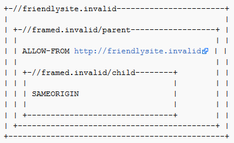

# Pertahanan Clickjacking

## Pengantar Pertahanan Clickjacking

Lembar contekan ini dimaksudkan untuk memberikan panduan bagi pengembang tentang cara bertahan terhadap [Clickjacking](https://owasp.org/www-community/attacks/Clickjacking), yang juga dikenal sebagai serangan perbaikan UI.

Ada tiga mekanisme utama yang dapat digunakan untuk bertahan terhadap serangan ini:

- Mencegah peramban memuat halaman dalam bingkai menggunakan header HTTP [X-Frame-Options](https://developer.mozilla.org/en-US/docs/Web/HTTP/Headers/X-Frame-Options) atau [Content Security Policy (frame-ancestors)](https://developer.mozilla.org/en-US/docs/Web/HTTP/Headers/Content-Security-Policy/frame-ancestors). - Mencegah cookie sesi disertakan saat halaman dimuat dalam bingkai menggunakan atribut cookie [SameSite](https://developer.mozilla.org/en-US/docs/Web/HTTP/Headers/Set-Cookie/SameSite).

- Menerapkan kode JavaScript di halaman untuk mencoba mencegahnya dimuat dalam bingkai (dikenal sebagai "frame-buster").

Perhatikan bahwa semua mekanisme ini independen satu sama lain, dan jika memungkinkan lebih dari satu mekanisme harus diterapkan untuk memberikan pertahanan yang mendalam.

## Mempertahankan dengan arahan frame-ancestors Kebijakan Keamanan Konten (CSP)

Arahan `frame-ancestors` dapat digunakan dalam header respons HTTP Content-Security-Policy untuk menunjukkan apakah browser diizinkan untuk merender halaman dalam `<frame>` atau `<iframe>`. Situs dapat menggunakan ini untuk menghindari serangan Clickjacking dengan memastikan bahwa konten mereka tidak disematkan ke situs lain.

`frame-ancestors` memungkinkan situs untuk mengotorisasi beberapa domain menggunakan semantik Kebijakan Keamanan Konten yang normal.

### Content-Security-Policy: frame-ancestors Contoh

Penggunaan umum CSP frame-ancestors:

- `Content-Security-Policy: frame-ancestors 'none';`
- Ini mencegah domain mana pun untuk membingkai konten. Pengaturan ini direkomendasikan kecuali kebutuhan khusus telah diidentifikasi untuk pembingkaian.
- `Content-Security-Policy: frame-ancestors 'self';`
- Ini hanya memungkinkan situs saat ini untuk membingkai konten. - `Content-Security-Policy: frame-ancestors 'self' *.somesite.com https://myfriend.site.com;`
- Ini mengizinkan situs saat ini, serta halaman mana pun di `somesite.com` (menggunakan protokol apa pun), dan hanya halaman `myfriend.site.com`, yang menggunakan HTTPS hanya pada port default (443).

Perhatikan bahwa tanda kutip tunggal diperlukan di sekitar `self` dan `none`, tetapi tidak boleh muncul di sekitar ekspresi sumber lainnya.

Lihat dokumentasi berikut untuk detail lebih lanjut dan contoh yang lebih kompleks:

- `https://w3c.github.io/webappsec-csp/#directive-frame-ancestors`
- `https://developer.mozilla.org/en-US/docs/Web/HTTP/Headers/Content-Security-Policy/frame-ancestors`

### Keterbatasan

- **X-Frame-Options diutamakan:** [Bagian "Hubungan dengan X-Frame-Options" dari Spesifikasi CSP](https://w3c.github.io/webappsec/specs/content-security-policy/#frame-ancestors-and-frame-options) mengatakan: "*Jika sumber daya dikirimkan dengan kebijakan yang menyertakan direktif bernama frame-ancestors dan yang disposisinya adalah "enforce", maka header X-Frame-Options HARUS diabaikan*", tetapi Chrome 40 & Firefox 35 mengabaikan direktif frame-ancestors dan ikuti header X-Frame-Options sebagai gantinya.

### Dukungan Peramban

[Peramban](https://caniuse.com/?search=frame-ancestors) berikut mendukung frame-ancestors CSP.

Referensi:

- [Mozilla Developer Network](https://developer.mozilla.org/en-US/docs/Web/HTTP/Headers/Content-Security-Policy/frame-ancestors#browser_compatibility)

## Pertahanan dengan Header Respons X-Frame-Options

Header respons HTTP `X-Frame-Options` dapat digunakan untuk menunjukkan apakah peramban boleh merender halaman dalam `<frame>` atau `<iframe>` atau tidak. Situs dapat menggunakan ini untuk menghindari serangan Clickjacking, dengan memastikan bahwa konten mereka tidak disematkan ke situs lain. Tetapkan header X-Frame-Options untuk semua respons yang berisi konten HTML. Nilai yang mungkin adalah "DENY", "SAMEORIGIN", atau "ALLOW-FROM uri"

### Jenis Header X-Frame-Options

Ada tiga nilai yang mungkin untuk header X-Frame-Options:

- **DENY**, yang mencegah domain mana pun membingkai konten. Pengaturan "DENY" direkomendasikan kecuali jika kebutuhan khusus telah diidentifikasi untuk pembingkaian.
- **SAMEORIGIN**, yang hanya mengizinkan situs saat ini untuk membingkai konten.
- **ALLOW-FROM uri**, yang mengizinkan 'uri' yang ditentukan untuk membingkai halaman ini. (misalnya, `ALLOW-FROM http://www.example.com`).
- Ini adalah arahan usang yang tidak lagi berfungsi di browser modern.
- Periksa batasan di bawah ini karena ini akan gagal dibuka jika browser tidak mendukungnya.
- Browser lain mendukung [arahan frame-ancestors CSP](https://w3c.github.io/webappsec-csp/#directive-frame-ancestors) yang baru. Beberapa mendukung keduanya.

### Dukungan Peramban

[Peramban](https://caniuse.com/#search=X-Frame-Options) berikut mendukung header X-Frame-Options.

Referensi:

- [Mozilla Developer Network](https://developer.mozilla.org/en-US/docs/web/http/headers/x-frame-options#browser_compatibility)
- [IETF Draft](http://datatracker.ietf.org/doc/draft-ietf-websec-x-frame-options/)
- [X-Frame-Options Compatibility Test](https://erlend.oftedal.no/blog/tools/xframeoptions/) - Periksa ini untuk info dukungan browser TERBARU untuk header X-Frame-Options

### Implementasi

Untuk menerapkan perlindungan ini, Anda perlu menambahkan header Respons HTTP `X-Frame-Options` ke halaman mana pun yang ingin Anda lindungi agar tidak di-clickjack melalui framebusting. Salah satu cara untuk melakukannya adalah dengan menambahkan Header Respons HTTP secara manual ke setiap halaman. Cara yang mungkin lebih sederhana adalah dengan menerapkan filter yang secara otomatis menambahkan header ke setiap halaman atau menambahkannya di Web Application Firewall pada level Web/Application Server.

### Kesalahan Pertahanan Umum

Meta-tag yang mencoba menerapkan perintah X-Frame-Options TIDAK BERFUNGSI. Misalnya, `<meta http-equiv="X-Frame-Options" content="deny">` tidak akan berfungsi. Anda harus menerapkan perintah X-FRAME-OPTIONS sebagai HTTP Response Header seperti yang dijelaskan di atas.

### Keterbatasan

- **Spesifikasi kebijakan per halaman**: Kebijakan perlu ditetapkan untuk setiap halaman, yang dapat mempersulit penerapan. Memberikan kemampuan untuk menerapkannya untuk seluruh situs, misalnya pada waktu login, dapat menyederhanakan penerapan.
- **Masalah dengan situs multidomain**: Penerapan saat ini tidak memungkinkan administrator situs web untuk menyediakan daftar domain yang diizinkan untuk membingkai halaman. Meskipun mencantumkan domain yang diizinkan dapat berbahaya, dalam beberapa kasus administrator situs web mungkin tidak punya pilihan selain menggunakan lebih dari satu nama host.
- **Dukungan browser ALLOW-FROM**: Opsi ALLOW-FROM sudah usang dan tidak lagi berfungsi di browser modern. HATI-HATI TERHADAP KETERGANTUNGAN PADA ALLOW-FROM. Jika Anda menerapkannya dan browser tidak mendukungnya, maka Anda TIDAK akan memiliki pertahanan clickjacking.
- **Beberapa opsi tidak didukung**: Tidak ada cara untuk mengizinkan situs saat ini dan situs pihak ketiga untuk membingkai respons yang sama. Browser hanya menghormati satu header X-Frame-Options dan hanya satu nilai pada header tersebut.
- **Bingkai Bersarang tidak berfungsi dengan SAMEORIGIN dan ALLOW-FROM**: Dalam situasi berikut, bingkai `http://framed.invalid/child` tidak dimuat karena ALLOW-FROM berlaku untuk konteks penelusuran tingkat atas, bukan induk langsung. Solusinya adalah menggunakan ALLOW-FROM di frame induk dan anak (tetapi ini mencegah pemuatan frame anak jika halaman `//framed.invalid/parent` dimuat sebagai dokumen tingkat atas).



- **X-Frame-Options Tidak Digunakan Lagi** Meskipun header X-Frame-Options didukung oleh browser utama, header tersebut telah ditinggalkan dan digantikan oleh direktif frame-ancestors dari spesifikasi CSP Level 2.
- **Proxy** Proxy web terkenal karena menambahkan dan menghapus header. Jika proxy web menghapus header X-Frame-Options, situs tersebut kehilangan perlindungan framing-nya.

## Mempertahankan dengan Cookie SameSite

Atribut kuki `SameSite` yang didefinisikan dalam [RFC 6265bis](https://tools.ietf.org/html/draft-ietf-httpbis-rfc6265bis-02#section-5.3.7) terutama ditujukan untuk melindungi dari [pemalsuan permintaan lintas situs (CSRF)](Cross-Site_Request_Forgery_Prevention_Cheat_Sheet.md#samesite-cookie-attribute); namun, atribut ini juga dapat memberikan perlindungan terhadap serangan Clickjacking.

Kuki dengan atribut `SameSite` baik `strict` maupun `lax` tidak akan disertakan dalam permintaan yang dibuat ke halaman dalam `<iframe>`. Ini berarti bahwa jika kuki sesi ditandai sebagai `SameSite`, serangan Clickjacking apa pun yang mengharuskan korban untuk diautentikasi tidak akan berfungsi, karena kuki tidak akan dikirim. Artikel di [blog Netsparker](https://www.netsparker.com/blog/web-security/same-site-cookie-attribute-prevent-cross-site-request-forgery/) memberikan detail lebih lanjut tentang jenis permintaan cookie yang dikirim dengan berbagai kebijakan SameSite.

Pendekatan ini dibahas di [situs web JavaScript.info](https://javascript.info/clickjacking#samesite-cookie-attribute).

### Keterbatasan

Jika serangan Clickjacking tidak mengharuskan pengguna untuk diautentikasi, atribut ini tidak akan memberikan perlindungan apa pun.

Selain itu, meskipun atribut `SameSite` didukung oleh [sebagian besar browser modern](https://caniuse.com/#feat=same-site-cookie-attribute), masih ada beberapa pengguna (sekitar 6% per November 2020) dengan browser yang tidak mendukungnya.

Penggunaan atribut ini harus dianggap sebagai bagian dari pendekatan pertahanan berlapis, dan tidak boleh diandalkan sebagai satu-satunya tindakan perlindungan terhadap Clickjacking.

## Skrip Pemutus Bingkai Peramban Lama Terbaik untuk Saat Ini

Salah satu cara untuk bertahan terhadap clickjacking adalah dengan menyertakan skrip "pemutus bingkai" di setiap halaman yang tidak boleh dibingkai. Metodologi berikut akan mencegah halaman web dibingkai bahkan di peramban lama, yang tidak mendukung X-Frame-Options-Header.

Di elemen HEAD dokumen, tambahkan yang berikut:

Terapkan ID ke elemen gaya itu sendiri terlebih dahulu:

```html
<style id="antiClickjack">
    body{display:none !important;}
</style>
```

Kemudian, hapus gaya tersebut berdasarkan ID-nya segera setelah di skrip:

```html
<script type="text/javascript">
    if (self === top) {
        var antiClickjack = document.getElementById("antiClickjack");
        antiClickjack.parentNode.removeChild(antiClickjack);
    } else {
        top.location = self.location;
    }
</script>
```

Dengan cara ini, semuanya dapat berada di dokumen HEAD dan Anda hanya memerlukan satu metode/taglib di API Anda.

## Perlindungan window.confirm()

Penggunaan X-Frame-Options atau skrip pemutus bingkai merupakan metode perlindungan clickjacking yang lebih aman. Namun, dalam skenario di mana konten harus dapat dibingkai, maka `window.confirm()` dapat digunakan untuk membantu mengurangi Clickjacking dengan memberi tahu pengguna tentang tindakan yang akan mereka lakukan.

Memanggil `window.confirm()` akan menampilkan popup yang tidak dapat dibingkai. Jika `window.confirm()` berasal dari dalam iframe dengan domain yang berbeda dari induknya, maka kotak dialog akan menampilkan dari domain mana `window.confirm()` berasal. Dalam skenario ini, browser menampilkan asal kotak dialog untuk membantu mengurangi serangan Clickjacking. Perlu dicatat bahwa Internet Explorer adalah satu-satunya browser yang diketahui tidak menampilkan domain asal kotak dialog `window.confirm()`, untuk mengatasi masalah ini dengan Internet Explorer, pastikan bahwa pesan dalam kotak dialog berisi informasi kontekstual tentang jenis tindakan yang sedang dilakukan. Misalnya:

```html
<script type="text/javascript">
   var action_confirm = window.confirm("Are you sure you want to delete your youtube account?")
   if (action_confirm) {
       //... Perform action
   } else {
       //... The user does not want to perform the requested action.`
   }
</script>
```

## Skrip Tidak Aman yang Tidak Berfungsi JANGAN DIGUNAKAN

Pertimbangkan cuplikan berikut yang **TIDAK direkomendasikan** untuk melindungi dari clickjacking:

```html
<script>if (top!=self) top.location.href=self.location.href</script>
```

Skrip pemutusan bingkai sederhana ini berupaya mencegah halaman dimasukkan ke dalam bingkai atau iframe dengan memaksa jendela induk memuat URL bingkai saat ini. Sayangnya, beberapa cara untuk mengalahkan skrip jenis ini telah dipublikasikan. Kami menguraikan beberapa di sini.

### Pembingkaian Ganda

Beberapa teknik pemutusan bingkai menavigasi ke halaman yang benar dengan menetapkan nilai ke `parent.location`. Ini berfungsi dengan baik jika halaman korban dibingkai oleh satu halaman. Namun, jika penyerang menyertakan korban dalam satu bingkai di dalam bingkai lain (bingkai ganda), maka mengakses `parent.location` menjadi pelanggaran keamanan di semua browser populer, karena **kebijakan navigasi bingkai turunan**. Pelanggaran keamanan ini menonaktifkan navigasi tindakan balasan.

**Kode pemutusan bingkai korban:**

```javascript
if(top.location != self.location) {
    parent.location = self.location;
}
```

**Attacker top frame:**

```html
<iframe src="attacker2.html">
```

**Attacker sub-frame:**

```html
<iframe src="http://www.victim.com">
```

### Peristiwa onBeforeUnload

Pengguna dapat secara manual membatalkan permintaan navigasi yang dikirimkan oleh halaman yang dibingkai. Untuk memanfaatkan ini, halaman pembingkaian mendaftarkan pengendali `onBeforeUnload` yang dipanggil setiap kali halaman pembingkaian akan dibongkar karena navigasi. Fungsi pengendali mengembalikan string yang menjadi bagian dari perintah yang ditampilkan kepada pengguna.

Misalnya penyerang ingin membingkai PayPal. Ia mendaftarkan fungsi pengendali pembongkaran yang mengembalikan string "Apakah Anda ingin keluar dari PayPal?". Ketika string ini ditampilkan kepada pengguna, navigasi kemungkinan akan dibatalkan, sehingga menggagalkan upaya pembongkaran bingkai PayPal.

Penyerang melancarkan serangan ini dengan mendaftarkan peristiwa pembongkaran di halaman atas menggunakan kode berikut:

```html
<script>
    window.onbeforeunload = function(){
        return "Asking the user nicely";
    }
</script>

<iframe src="http://www.paypal.com">
```

Kode pembongkar bingkai PayPal akan menghasilkan peristiwa `BeforeUnload` yang mengaktifkan fungsi kami dan meminta pengguna untuk membatalkan peristiwa navigasi.

### Pembilasan Tanpa Konten

Meskipun serangan sebelumnya memerlukan interaksi pengguna, serangan yang sama dapat dilakukan tanpa meminta pengguna. Sebagian besar peramban (IE7, IE8, Google Chrome, dan Firefox) memungkinkan penyerang untuk secara otomatis membatalkan permintaan navigasi yang masuk dalam pengendali peristiwa `onBeforeUnload` dengan mengirimkan permintaan navigasi berulang kali ke situs yang merespons dengan "*204 - Tanpa Konten*".

Menavigasi ke situs Tanpa Konten secara efektif merupakan NOP, tetapi membersihkan jalur permintaan, sehingga membatalkan permintaan navigasi asli. Berikut adalah contoh kode untuk melakukannya:

```javascript
var preventbust = 0
window.onbeforeunload = function() { killbust++ }
setInterval( function() {
    if(killbust > 0){
    killbust = 2;
    window.top.location = 'http://nocontent204.com'
    }
}, 1);
```

```html
<iframe src="http://www.victim.com">
```

### Memanfaatkan filter XSS

IE8 dan Google Chrome memperkenalkan filter XSS reflektif yang membantu melindungi halaman web dari jenis serangan XSS tertentu. Nava dan Lindsay (di "Blackhat") mengamati bahwa filter ini dapat digunakan untuk menghindari kode pembobolan bingkai. Filter XSS IE8 membandingkan parameter permintaan yang diberikan dengan serangkaian ekspresi reguler untuk mencari upaya yang jelas dalam skrip lintas situs. Dengan menggunakan "positif palsu yang diinduksi", filter dapat digunakan untuk menonaktifkan skrip yang dipilih. Dengan mencocokkan awal tag skrip apa pun dalam parameter permintaan, filter XSS akan menonaktifkan semua skrip sebaris di dalam halaman, termasuk skrip pembobolan bingkai. Skrip eksternal juga dapat ditargetkan dengan mencocokkan penyertaan eksternal, yang secara efektif menonaktifkan semua skrip eksternal. Karena subset JavaScript yang dimuat masih berfungsi (sebaris atau eksternal) dan kuki masih tersedia, serangan ini efektif untuk clickjacking.

**Kode pembobolan bingkai korban:**

```html
<script>
    if(top != self) {
        top.location = self.location;
    }
</script>
```

**Penyerang:**

```html
<iframe src="http://www.victim.com/?v=<script>if''>
```

Filter XSS akan mencocokkan parameter `<script>if` dengan awal skrip pembobolan bingkai pada korban dan akibatnya akan menonaktifkan semua skrip sebaris di halaman korban, termasuk skrip pembobolan bingkai. Filter XSSAuditor yang tersedia untuk Google Chrome memungkinkan eksploitasi yang sama.

### Merusak top.location

Beberapa browser modern memperlakukan variabel lokasi sebagai atribut khusus yang tidak dapat diubah di semua konteks. Namun, ini tidak terjadi di IE7 dan Safari 4.0.4 di mana variabel lokasi dapat didefinisikan ulang.

**IE7**: Setelah halaman pembobolan mendefinisikan ulang lokasi, kode pembobolan bingkai apa pun dalam subbingkai yang mencoba membaca `top.location` akan melakukan pelanggaran keamanan dengan mencoba membaca variabel lokal di domain lain. Demikian pula, setiap upaya untuk menavigasi dengan menetapkan `top.location` akan gagal.

**Kode pembobolan bingkai korban:**

```javascript
if(top.location != self.location) {
    top.location = self.location;
}
```

**Penyerang:**

```html
<script>var location = "clobbered";</script>
<iframe src="http://www.victim.com"></iframe>
```

**Safari 4.0.4:**

Kami mengamati bahwa meskipun lokasi tetap tidak dapat diubah dalam sebagian besar keadaan, ketika penentu lokasi kustom didefinisikan melalui `defineSetter` (melalui jendela), lokasi objek menjadi tidak terdefinisi.

Halaman pembingkaian hanya melakukan:

```html
<script>
    window.defineSetter("location", function(){});
</script>
```

Sekarang, setiap upaya untuk membaca atau menavigasi lokasi bingkai teratas akan gagal.

### Zona terbatas

Sebagian besar penghilangan bingkai bergantung pada JavaScript di halaman yang dibingkai untuk mendeteksi pembingkaian dan menghilangkannya sendiri. Jika JavaScript dinonaktifkan dalam konteks subbingkai, kode penghilangan bingkai tidak akan berjalan. Sayangnya, ada beberapa cara untuk membatasi JavaScript di subbingkai:

**In IE 8:**

```html
<iframe src="http://www.victim.com" security="restricted"></iframe>
```

**In Chrome:**

```html
<iframe src="http://www.victim.com" sandbox></iframe>
```

**Firefox dan IE:**

Aktifkan [designMode](https://developer.mozilla.org/en-US/docs/Web/API/Document/designMode) di halaman induk.

```javascript
document.designMode = "on";
```

###### Copyright © - This cheat sheet was created from the OWASP CheatSheetSeries reference - Source :` https://cheatsheetseries.owasp.org/ `