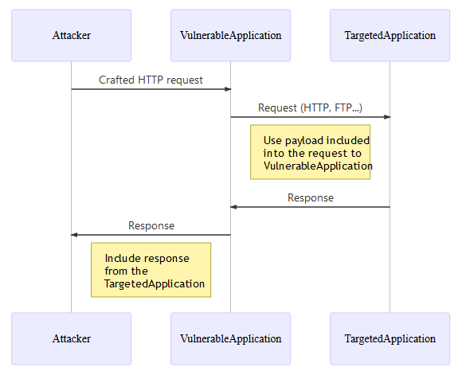
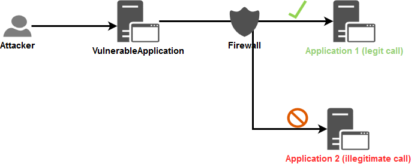

# Pencegahan Pemalsuan Permintaan Sisi Server (Server Side Request Forgery)

## Pendahuluan tentang Pencegahan Pemalsuan Permintaan Sisi Server (Server Side Request Forgery)

Tujuan lembar contekan ini adalah untuk memberikan saran mengenai perlindungan terhadap serangan [Pemalsuan Permintaan Sisi Server](https://www.acunetix.com/blog/articles/server-side-request-forgery-vulnerability/) (SSRF).

Lembar contekan ini akan berfokus pada sudut pandang defensif dan tidak akan menjelaskan cara melakukan serangan ini. [pembicaraan](./img/Server_Side_Request_Forgery_Prevention_Cheat_Sheet_Orange_Tsai_Talk.pdf) dari peneliti keamanan [Orange Tsai](https://twitter.com/orange_8361) ini serta [dokumen](./img/Server_Side_Request_Forgery_Prevention_Cheat_Sheet_SSRF_Bible.pdf) ini memberikan teknik tentang cara melakukan serangan semacam ini.

## Konteks

SSRF adalah vektor serangan yang menyalahgunakan aplikasi untuk berinteraksi dengan jaringan internal/eksternal atau mesin itu sendiri. Salah satu pendorong vektor ini adalah kesalahan penanganan URL, seperti yang ditunjukkan dalam contoh berikut:

- Gambar di server eksternal (*misalnya* pengguna memasukkan URL gambar avatar mereka agar aplikasi dapat mengunduh dan menggunakannya).

- [WebHook](https://en.wikipedia.org/wiki/Webhook) Kustom (pengguna harus menentukan pengendali Webhook atau URL Panggilan Balik).

- Permintaan internal untuk berinteraksi dengan layanan lain guna melayani fungsionalitas tertentu. Sering kali, data pengguna dikirim untuk diproses, dan jika ditangani dengan buruk, dapat melakukan serangan injeksi tertentu.

## Tinjauan umum alur umum SSRF



*Catatan:*

- SSRF tidak terbatas pada protokol HTTP. Umumnya, permintaan pertama adalah HTTP, tetapi dalam kasus di mana aplikasi itu sendiri melakukan permintaan kedua, aplikasi tersebut dapat menggunakan protokol yang berbeda (*misalnya* FTP, SMB, SMTP, dll.) dan skema (*misalnya* `file://`, `phar://`, `gopher://`, `data://`, `dict://`, dll.).
- Jika aplikasi rentan terhadap [injeksi XML eXternal Entity (XXE)](https://portswigger.net/web-security/xxe) maka aplikasi tersebut dapat dieksploitasi untuk melakukan [serangan SSRF](https://portswigger.net/web-security/xxe#exploiting-xxe-to-perform-ssrf-attacks), lihat [lembar contekan XXE](XML_External_Entity_Prevention_Cheat_Sheet.md) untuk mempelajari cara mencegah paparan XXE.

## Kasus

Tergantung pada fungsionalitas dan persyaratan aplikasi, ada dua kasus dasar di mana SSRF dapat terjadi:

- Aplikasi hanya dapat mengirim permintaan ke **aplikasi yang teridentifikasi dan tepercaya**: Kasus ketika pendekatan [daftar yang diizinkan](https://en.wikipedia.org/wiki/Whitelisting) tersedia.
- Aplikasi dapat mengirim permintaan ke **alamat IP eksternal atau nama domain APAPUN**: Kasus ketika pendekatan [daftar yang diizinkan](https://en.wikipedia.org/wiki/Whitelisting) tidak tersedia.

Karena kedua kasus ini sangat berbeda, lembar contekan ini akan menjelaskan pembelaan terhadapnya secara terpisah.

### Kasus 1 - Aplikasi hanya dapat mengirim permintaan ke aplikasi yang teridentifikasi dan tepercaya

Terkadang, aplikasi perlu melakukan permintaan ke aplikasi lain, yang sering kali berlokasi di jaringan lain, untuk melakukan tugas tertentu. Bergantung pada kasus bisnis, input pengguna diperlukan agar fungsionalitas dapat berfungsi.

#### Contoh

 > Ambil contoh aplikasi web yang menerima dan menggunakan informasi pribadi dari pengguna, seperti nama depan, nama belakang, tanggal lahir, dll. untuk membuat profil dalam sistem SDM internal. Berdasarkan desain, aplikasi web tersebut harus berkomunikasi menggunakan protokol yang dipahami sistem SDM untuk memproses data tersebut.
> Pada dasarnya, pengguna tidak dapat mengakses sistem SDM secara langsung, tetapi, jika aplikasi web yang bertugas menerima informasi pengguna rentan terhadap SSRF, pengguna dapat memanfaatkannya untuk mengakses sistem SDM.
> Pengguna memanfaatkan aplikasi web sebagai proksi ke sistem SDM.

Pendekatan daftar putih merupakan opsi yang layak karena aplikasi internal yang dipanggil oleh *VulnerableApplication* diidentifikasi dengan jelas dalam alur teknis/bisnis. Dapat dinyatakan bahwa panggilan yang diperlukan hanya akan ditargetkan antara aplikasi yang diidentifikasi dan tepercaya.

#### Perlindungan yang tersedia

Beberapa tindakan perlindungan dapat dilakukan pada lapisan **Aplikasi** dan **Jaringan**. Untuk menerapkan prinsip **pertahanan berlapis**, kedua lapisan akan diperkuat terhadap serangan tersebut.

##### Lapisan aplikasi

Tingkat perlindungan pertama yang terlintas dalam pikiran adalah [Validasi input](Input_Validation_Cheat_Sheet.md).

Berdasarkan hal tersebut, pertanyaan berikut muncul dalam pikiran: *Bagaimana cara melakukan validasi input ini?*

Seperti yang ditunjukkan [Orange Tsai](https://twitter.com/orange_8361) dalam [pembicaraannya](./img/Server_Side_Request_Forgery_Prevention_Cheat_Sheet_Orange_Tsai_Talk.pdf), tergantung pada bahasa pemrograman yang digunakan, parser dapat disalahgunakan. Salah satu tindakan pencegahan yang mungkin adalah menerapkan [pendekatan daftar yang diizinkan](Input_Validation_Cheat_Sheet.md#allow-list-vs-block-list) saat validasi input digunakan karena, sebagian besar waktu, format informasi yang diharapkan dari pengguna diketahui secara global.

Permintaan yang dikirim ke aplikasi internal akan didasarkan pada informasi berikut:

- String yang berisi data bisnis.
- Alamat IP (V4 atau V6).
- Nama domain.
- URL.

**Catatan:** Nonaktifkan dukungan untuk [pengalihan](https://developer.mozilla.org/en-US/docs/Web/HTTP/Redirections) berikut di klien web Anda untuk mencegah pengabaian validasi input yang dijelaskan di bagian `Trik eksploitasi > Mengabaikan batasan > Validasi input > Pengalihan tidak aman` dari [dokumen](./img/Server_Side_Request_Forgery_Prevention_Cheat_Sheet_SSRF_Bible.pdf) ini.

###### String

Dalam konteks SSRF, validasi dapat ditambahkan untuk memastikan bahwa string input mematuhi format bisnis/teknis yang diharapkan.

[Regex](https://www.regular-expressions.info/) dapat digunakan untuk memastikan bahwa data yang diterima valid dari sudut pandang keamanan jika data input memiliki format sederhana (*misalnya* token, kode pos, dll.). Jika tidak, validasi harus dilakukan menggunakan pustaka yang tersedia dari objek `string` karena regex untuk format kompleks sulit dipertahankan dan sangat rawan kesalahan.

Input pengguna diasumsikan tidak terkait jaringan dan terdiri dari informasi pribadi pengguna.

Contoh:

```java
//Regex validation for a data having a simple format
if(Pattern.matches("[a-zA-Z0-9\\s\\-]{1,50}", userInput)){
    //Continue the processing because the input data is valid
}else{
    //Stop the processing and reject the request
}
```

###### Alamat IP

Dalam konteks SSRF, ada 2 validasi yang dapat dilakukan:

1. Pastikan bahwa data yang diberikan adalah alamat IP V4 atau V6 yang valid.

2. Pastikan bahwa alamat IP yang diberikan adalah milik salah satu alamat IP dari aplikasi yang teridentifikasi dan tepercaya.

Lapisan validasi pertama dapat diterapkan menggunakan pustaka yang memastikan keamanan format alamat IP, berdasarkan teknologi yang digunakan (opsi pustaka diusulkan di sini untuk mendelegasikan pengelolaan format alamat IP dan memanfaatkan fungsi validasi yang telah teruji):

> Verifikasi pustaka yang diusulkan telah dilakukan terkait paparan terhadap bypass (Hex, Octal, Dword, URL, dan Pengodean Campuran) yang dijelaskan dalam [artikel](https://medium.com/@vickieli/bypassing-ssrf-protection-e111ae70727b) ini.

- **JAVA:** Metode [InetAddressValidator.isValid](http://commons.apache.org/proper/commons-validator/apidocs/org/apache/commons/validator/routines/InetAddressValidator.html#isValid(java.lang.String)) dari pustaka [Apache Commons Validator](http://commons.apache.org/proper/commons-validator/).
- **TIDAK diekspos** untuk melewati pengodean Hex, Octal, Dword, URL, dan Campuran.
- **.NET**: Metode [IPAddress.TryParse](https://docs.microsoft.com/en-us/dotnet/api/system.net.ipaddress.tryparse?view=netframework-4.8) dari SDK.
- **Diekspos** untuk melewati pengodean Hex, Octal, Dword, dan Campuran tetapi **BUKAN** pengodean URL. - Karena daftar putih digunakan di sini, setiap percobaan bypass akan diblokir selama perbandingan dengan daftar alamat IP yang diizinkan.
- **JavaScript**: Library [ip-address](https://www.npmjs.com/package/ip-address).
- **TIDAK terekspos** untuk bypass menggunakan enkode Hex, Octal, Dword, URL, dan Campuran.
- **Ruby**: Class [IPAddr](https://ruby-doc.org/stdlib-2.0.0/libdoc/ipaddr/rdoc/IPAddr.html) dari SDK.
- **TIDAK terekspos** untuk bypass menggunakan enkode Hex, Octal, Dword, URL, dan Campuran.

> **Gunakan nilai keluaran metode/library sebagai alamat IP untuk dibandingkan dengan daftar putih.**

Setelah memastikan validitas alamat IP yang masuk, lapisan validasi kedua diterapkan. Daftar putih dibuat setelah menentukan semua alamat IP (v4 dan v6 untuk menghindari bypass) dari aplikasi yang diidentifikasi dan tepercaya. IP yang valid diperiksa silang dengan daftar tersebut untuk memastikan komunikasinya dengan aplikasi internal (perbandingan ketat string dengan peka huruf besar/kecil).

###### Nama domain

Dalam upaya memvalidasi nama domain, jelas untuk melakukan resolusi DNS guna memverifikasi keberadaan domain. Secara umum, ini bukanlah ide yang buruk, namun hal ini membuka aplikasi terhadap serangan tergantung pada konfigurasi yang digunakan terkait server DNS yang digunakan untuk resolusi nama domain:

- Dapat mengungkapkan informasi ke resolver DNS eksternal.
- Dapat digunakan oleh penyerang untuk mengikat nama domain yang sah ke alamat IP internal. Lihat bagian `Trik eksploitasi > Melewati batasan > Validasi input > Penyematan DNS` dari [dokumen](./img/Server_Side_Request_Forgery_Prevention_Cheat_Sheet_SSRF_Bible.pdf) ini. - Penyerang dapat menggunakannya untuk mengirimkan muatan berbahaya ke resolver DNS internal dan API (SDK atau pihak ketiga) yang digunakan oleh aplikasi untuk menangani komunikasi DNS dan kemudian, berpotensi, memicu kerentanan di salah satu komponen ini.

Dalam konteks SSRF, ada dua validasi yang harus dilakukan:

1. Pastikan bahwa data yang diberikan adalah nama domain yang valid.

2. Pastikan bahwa nama domain yang diberikan milik salah satu nama domain dari aplikasi yang diidentifikasi dan tepercaya (daftar izin berlaku di sini).

Serupa dengan validasi alamat IP, lapisan validasi pertama dapat diterapkan menggunakan pustaka yang memastikan keamanan format nama domain, berdasarkan teknologi yang digunakan (opsi pustaka diusulkan di sini untuk mendelegasikan pengelolaan format nama domain dan memanfaatkan fungsi validasi yang telah teruji):

> Verifikasi pustaka yang diusulkan telah dilakukan untuk memastikan bahwa fungsi yang diusulkan tidak melakukan kueri resolusi DNS apa pun.

- **JAVA:** Metode [DomainValidator.isValid](https://commons.apache.org/proper/commons-validator/apidocs/org/apache/commons/validator/routines/DomainValidator.html#isValid(java.lang.String)) dari pustaka [Apache Commons Validator](http://commons.apache.org/proper/commons-validator/).
- **.NET**: Metode [Uri.CheckHostName](https://docs.microsoft.com/en-us/dotnet/api/system.uri.checkhostname?view=netframework-4.8) dari SDK.
- **JavaScript**: Pustaka [is-valid-domain](https://www.npmjs.com/package/is-valid-domain). - **Python**: Modul [validators.domain](https://validators.readthedocs.io/en/latest/#module-validators.domain).
- **Ruby**: Tidak ditemukan gem khusus yang valid.
- [domainator](https://github.com/mhuggins/domainator), [public_suffix](https://github.com/weppos/publicsuffix-ruby), dan [addressable](https://github.com/sporkmonger/addressable) telah diuji tetapi sayangnya semuanya menganggap `<script>alert(1)</script>.owasp.org` sebagai nama domain yang valid. - Regex ini, diambil dari [di sini](https://stackoverflow.com/a/26987741), dapat digunakan: `^(((?!-))(xn--|_{1,1})?[a-z0-9-]{0,61}[a-z0-9]{1,1}\.)*(xn--)?([a-z0-9][a-z0-9\-]{0,60}|[a-z0-9-]{1,30}\.[a-z]{2,})$`

Contoh pelaksanaan regex yang diusulkan untuk Ruby:

```ruby
domain_names = ["owasp.org","owasp-test.org","doc-test.owasp.org","doc.owasp.org",
                "<script>alert(1)</script>","<script>alert(1)</script>.owasp.org"]
domain_names.each { |domain_name|
    if ( domain_name =~ /^(((?!-))(xn--|_{1,1})?[a-z0-9-]{0,61}[a-z0-9]{1,1}\.)*(xn--)?([a-z0-9][a-z0-9\-]{0,60}|[a-z0-9-]{1,30}\.[a-z]{2,})$/ )
        puts "[i] #{domain_name} is VALID"
    else
        puts "[!] #{domain_name} is INVALID"
    end
}
```

```bash
$ ruby test.rb
[i] owasp.org is VALID
[i] owasp-test.org is VALID
[i] doc-test.owasp.org is VALID
[i] doc.owasp.org is VALID
[!] <script>alert(1)</script> is INVALID
[!] <script>alert(1)</script>.owasp.org is INVALID
```

Setelah memastikan validitas nama domain yang masuk, lapisan validasi kedua diterapkan:

1. Buat daftar yang diizinkan dengan semua nama domain dari setiap aplikasi yang teridentifikasi dan tepercaya.

2. Verifikasi bahwa nama domain yang diterima adalah bagian dari daftar yang diizinkan ini (perbandingan ketat string dengan peka huruf besar/kecil).

Sayangnya, di sini, aplikasi masih rentan terhadap bypass `DNS pinning` yang disebutkan dalam [dokumen](./img/Server_Side_Request_Forgery_Prevention_Cheat_Sheet_SSRF_Bible.pdf) ini. Memang, resolusi DNS akan dibuat saat kode bisnis akan dieksekusi. Untuk mengatasi masalah tersebut, tindakan berikut harus diambil sebagai tambahan dari validasi pada nama domain:

1. Pastikan bahwa domain yang menjadi bagian dari organisasi Anda diselesaikan oleh server DNS internal Anda terlebih dahulu dalam rantai resolver DNS.

2. Pantau daftar domain yang diizinkan untuk mendeteksi saat salah satu dari mereka diselesaikan ke:

- Alamat IP lokal (V4 + V6). - IP internal organisasi Anda (diharapkan berada dalam rentang IP pribadi) untuk domain yang bukan bagian dari organisasi Anda.

Skrip Python3 berikut dapat digunakan, sebagai titik awal, untuk pemantauan yang disebutkan di atas:

```python
# Ketergantungan: pip install ipaddress dnspython
import ipaddress
import dns.resolver

# Konfigurasikan daftar yang diizinkan untuk dicentang
DOMAINS_ALLOWLIST = ["owasp.org", "labslinux"]

# Konfigurasikan resolver DNS untuk digunakan untuk semua kueri DNS
DNS_RESOLVER = dns.resolver.Resolver()
DNS_RESOLVER.nameservers = ["1.1.1.1"]

def verify_dns_records(domain, records, type):
    """
    Verifikasi apakah salah satu rekaman DNS mengarah ke alamat IP nonpublik.
Kembalikan boolean yang menunjukkan apakah ada kesalahan yang terdeteksi.
    """
    error_detected = False
    if records is not None:
        for record in records:
            value = record.to_text().strip()
            try:
                ip = ipaddress.ip_address(value)
                # See https://docs.python.org/3/library/ipaddress.html#ipaddress.IPv4Address.is_global
                if not ip.is_global:
                    print("[!] DNS record type '%s' for domain name '%s' resolve to
                    a non public IP address '%s'!" % (type, domain, value))
                    error_detected = True
            except ValueError:
                error_detected = True
                print("[!] '%s' is not valid IP address!" % value)
    return error_detected

def check():
    """
    Lakukan pemeriksaan pada daftar domain yang diizinkan.
Kembalikan nilai boolean yang menunjukkan jika ada kesalahan yang terdeteksi.
    """
    error_detected = False
    for domain in DOMAINS_ALLOWLIST:
        # Get the IPs of the current domain
        # See https://en.wikipedia.org/wiki/List_of_DNS_record_types
        try:
            # A = IPv4 address record
            ip_v4_records = DNS_RESOLVER.query(domain, "A")
        except Exception as e:
            ip_v4_records = None
            print("[i] Cannot get A record for domain '%s': %s\n" % (domain,e))
        try:
            # AAAA = IPv6 address record
            ip_v6_records = DNS_RESOLVER.query(domain, "AAAA")
        except Exception as e:
            ip_v6_records = None
            print("[i] Cannot get AAAA record for domain '%s': %s\n" % (domain,e))
        # Verify the IPs obtained
        if verify_dns_records(domain, ip_v4_records, "A")
        or verify_dns_records(domain, ip_v6_records, "AAAA"):
            error_detected = True
    return error_detected

if __name__== "__main__":
    if check():
        exit(1)
    else:
        exit(0)
```

###### URL

Jangan terima URL lengkap dari pengguna karena URL sulit divalidasi dan parser dapat disalahgunakan tergantung pada teknologi yang digunakan seperti yang ditunjukkan oleh [pembicaraan](./img/Server_Side_Request_Forgery_Prevention_Cheat_Sheet_Orange_Tsai_Talk.pdf) berikut dari [Orange Tsai](https://twitter.com/orange_8361).

Jika informasi terkait jaringan benar-benar diperlukan, terima hanya alamat IP atau nama domain yang valid.

##### Lapisan jaringan

Tujuan keamanan lapisan Jaringan adalah untuk mencegah *VulnerableApplication* melakukan panggilan ke aplikasi yang sembarangan. Hanya *rute* yang diizinkan yang akan tersedia untuk aplikasi ini guna membatasi akses jaringannya hanya kepada mereka yang seharusnya berkomunikasi dengannya.

Komponen Firewall, sebagai perangkat tertentu atau menggunakan perangkat yang disediakan dalam sistem operasi, akan digunakan di sini untuk menentukan alur yang sah.

Dalam skema di bawah ini, komponen Firewall dimanfaatkan untuk membatasi akses aplikasi, dan pada gilirannya, membatasi dampak aplikasi yang rentan terhadap SSRF:



[Pemisahan jaringan](https://www.mwrinfosecurity.com/our-thinking/making-the-case-for-network-segregation) (lihat rangkaian [saran implementasi](https://www.cyber.gov.au/acsc/view-all-content/publications/implementing-network-segmentation-and-segregation) ini juga dapat dimanfaatkan dan **sangat direkomendasikan untuk memblokir panggilan tidak sah secara langsung di tingkat jaringan itu sendiri**.

### Kasus 2 - Aplikasi dapat mengirim permintaan ke alamat IP eksternal atau domain APAPUN nama

Kasus ini terjadi saat pengguna dapat mengontrol URL ke sumber daya **Eksternal** dan aplikasi membuat permintaan ke URL ini (misalnya dalam kasus [WebHook](https://en.wikipedia.org/wiki/Webhook)). Daftar yang diizinkan tidak dapat digunakan di sini karena daftar IP/domain sering kali tidak diketahui sebelumnya dan berubah secara dinamis.

Dalam skenario ini, *Eksternal* merujuk ke IP apa pun yang tidak termasuk dalam jaringan internal, dan harus dijangkau melalui internet publik.

Jadi, panggilan dari *Aplikasi Rentan*:

- **TIDAK** menargetkan salah satu IP/domain *yang berada di dalam* jaringan global perusahaan.

- Menggunakan konvensi yang ditetapkan antara *Aplikasi Rentan* dan IP/domain yang diharapkan untuk *membuktikan* bahwa panggilan telah dimulai secara sah.

#### Tantangan dalam memblokir URL di lapisan aplikasi

Berdasarkan persyaratan bisnis dari aplikasi yang disebutkan di atas, pendekatan daftar yang diizinkan bukanlah solusi yang valid. Meskipun mengetahui bahwa pendekatan daftar blokir bukanlah tembok yang tidak dapat ditembus, pendekatan ini merupakan solusi terbaik dalam skenario ini. Pendekatan ini memberi tahu aplikasi apa yang **tidak** boleh dilakukan.

Berikut ini alasan mengapa memfilter URL sulit dilakukan di lapisan Aplikasi:

- Ini menyiratkan bahwa aplikasi harus dapat mendeteksi, pada level kode, bahwa IP yang diberikan (V4 + V6) bukan bagian dari [rentang jaringan privat](https://en.wikipedia.org/wiki/Private_network) resmi termasuk juga alamat *localhost* dan *IPv4/v6 Link-Local*. Tidak setiap SDK menyediakan fitur bawaan untuk verifikasi semacam ini, dan menyerahkan penanganannya kepada pengembang untuk memahami semua jebakan dan nilai yang mungkin, yang menjadikannya tugas yang menuntut.

- Pernyataan yang sama untuk nama domain: Perusahaan harus menyimpan daftar semua nama domain internal dan menyediakan layanan terpusat untuk memungkinkan aplikasi memverifikasi apakah nama domain yang diberikan adalah nama internal. Untuk verifikasi ini, resolver DNS internal dapat ditanyakan oleh aplikasi tetapi resolver DNS internal ini tidak boleh menyelesaikan nama domain eksternal.

#### Proteksi yang tersedia

Dengan mempertimbangkan asumsi yang sama dalam [contoh](Server_Side_Request_Forgery_Prevention_Cheat_Sheet.md#example) berikut untuk bagian berikut.

##### Lapisan aplikasi

Seperti untuk kasus [n°1](Server_Side_Request_Forgery_Prevention_Cheat_Sheet.md#case-1-application-can-send-request-only-to-identified-and-trusted-applications), diasumsikan bahwa `Alamat IP` atau `nama domain` diperlukan untuk membuat permintaan yang akan dikirim ke *TargetApplication*.

Validasi pertama pada data input yang disajikan dalam kasus [n°1](Server_Side_Request_Forgery_Prevention_Cheat_Sheet.md#application-layer) pada 3 jenis data akan sama untuk kasus ini **TETAPI validasi kedua akan berbeda**. Memang, di sini kita harus menggunakan pendekatan daftar blokir.

> **Mengenai bukti keabsahan permintaan**: *TargetedApplication* yang akan menerima permintaan harus menghasilkan token acak (mis.: alfanumerik 20 karakter) yang diharapkan akan diteruskan oleh pemanggil (dalam badan melalui parameter yang namanya juga ditentukan oleh aplikasi itu sendiri dan hanya mengizinkan set karakter `[a-z]{1,10}`) untuk melakukan permintaan yang valid. Titik akhir penerima hanya boleh menerima permintaan HTTP POST.

**Alur validasi (jika salah satu langkah validasi gagal, maka permintaan ditolak):**

1. Aplikasi akan menerima alamat IP atau nama domain dari *TargetedApplication* dan akan menerapkan validasi pertama pada data input menggunakan pustaka/regex yang disebutkan dalam [bagian] ini(Server_Side_Request_Forgery_Prevention_Cheat_Sheet.md#application-layer).

2. Validasi kedua akan diterapkan terhadap alamat IP atau nama domain dari *TargetedApplication* menggunakan pendekatan daftar blokir berikut:

- Untuk alamat IP:

- Aplikasi akan memverifikasi bahwa itu adalah domain publik (lihat petunjuk yang diberikan di paragraf berikutnya dengan contoh kode python).

- Untuk nama domain:

1. Aplikasi akan memverifikasi bahwa itu adalah domain publik dengan mencoba menyelesaikan nama domain terhadap resolver DNS yang hanya akan menyelesaikan nama domain internal. Di sini, aplikasi harus mengembalikan respons yang menunjukkan bahwa ia tidak mengetahui domain yang diberikan karena nilai yang diharapkan diterima harus berupa domain publik. 2. Untuk mencegah serangan `DNS pinning` yang dijelaskan dalam [dokumen](./image/Server_Side_Request_Forgery_Prevention_Cheat_Sheet_SSRF_Bible.pdf) ini, aplikasi akan mengambil semua alamat IP di balik nama domain yang diberikan (mengambil rekaman *A* + *AAAA* untuk IPv4 + IPv6) dan akan menerapkan verifikasi yang sama yang dijelaskan pada poin sebelumnya tentang alamat IP.
3. Aplikasi akan menerima protokol yang akan digunakan untuk permintaan melalui parameter input khusus yang akan memverifikasi nilainya terhadap daftar protokol yang diizinkan (`HTTP` atau `HTTPS`).
4. Aplikasi akan menerima nama parameter untuk token yang akan diteruskan ke *TargetedApplication* melalui parameter input khusus yang akan mengizinkan hanya set karakter `[a-z]{1,10}`. 5. Aplikasi akan menerima token itu sendiri melalui parameter input khusus yang hanya mengizinkan set karakter `[a-zA-Z0-9]{20}`.
6. Aplikasi akan menerima dan memvalidasi (dari sudut pandang keamanan) data bisnis apa pun yang diperlukan untuk melakukan panggilan yang valid.
7. Aplikasi akan membuat permintaan HTTP POST **hanya menggunakan informasi yang divalidasi** dan akan mengirimkannya (*jangan lupa untuk menonaktifkan dukungan untuk [pengalihan](https://developer.mozilla.org/en-US/docs/Web/HTTP/Redirections) di klien web yang digunakan*).

##### Lapisan jaringan

Mirip dengan [bagian](Server_Side_Request_Forgery_Prevention_Cheat_Sheet.md#network-layer) berikut.

## IMDSv2 di AWS

Di lingkungan cloud, SSRF sering digunakan untuk mengakses dan mencuri kredensial serta token akses dari layanan metadata (misalnya AWS Instance Metadata Service, Azure Instance Metadata Service, server metadata GCP).

[IMDSv2](https://aws.amazon.com/blogs/security/defense-in-depth-open-firewalls-reverse-proxies-ssrf-vulnerabilities-ec2-instance-metadata-service/) adalah mekanisme pertahanan berlapis tambahan untuk AWS yang mengurangi beberapa instans SSRF.

Untuk memanfaatkan perlindungan ini, migrasikan ke IMDSv2 dan nonaktifkan IMDSv1 lama. Lihat [dokumentasi AWS](https://docs.aws.amazon.com/AWSEC2/latest/UserGuide/instancedata-data-retrieval.html) untuk detail selengkapnya.

## Aturan Semgrep

[Semgrep](https://semgrep.dev/) adalah alat baris perintah untuk analisis statis offline. Gunakan aturan yang telah dibuat sebelumnya atau khusus untuk menegakkan kode dan standar keamanan dalam basis kode Anda. Lihat aturan Semgrep untuk SSRF guna mengidentifikasi/menyelidiki kerentanan SSRF di Java
[https://semgrep.dev/salecharohit:owasp_java_ssrf](https://semgrep.dev/salecharohit:owasp_java_ssrf)

## Referensi

Versi daring [kitab suci SSRF](https://docs.google.com/document/d/1v1TkWZtrhzRLy0bYXBcdLUedXGb9njTNIJXa3u9akHM) (versi PDF digunakan dalam lembar contekan ini).

Artikel tentang [Melewati Perlindungan SSRF](https://medium.com/@vickieli/bypassing-ssrf-protection-e111ae70727b).

Artikel tentang serangan SSRF: [Bagian 1](https://medium.com/poka-techblog/server-side-request-forgery-ssrf-attacks-part-1-the-basics-a42ba5cc244a), [bagian 2](https://medium.com/poka-techblog/server-side-request-forgery-ssrf-attacks-part-2-fun-with-ipv4-addresses-eb51971e476d) dan [bagian 3](https://medium.com/poka-techblog/server-side-request-forgery-ssrf-part-3-other-advanced-techniques-3f48cbcad27e). Artikel tentang [IMDSv2](https://aws.amazon.com/blogs/security/defense-in-depth-open-firewalls-reverse-proxies-ssrf-vulnerabilities-ec2-instance-metadata-service/)

## Alat dan kode yang digunakan untuk skema

- [Mermaid Online Editor](https://mermaidjs.github.io/mermaid-live-editor) dan [Mermaid documentation](https://mermaidjs.github.io/).
- [Draw.io Online Editor](https://www.draw.io/).

Kode Mermaid untuk alur umum SSRF (printscreen digunakan untuk mengambil gambar PNG yang dimasukkan ke dalam lembar contekan ini):

```text
sequenceDiagram
    participant Attacker
    participant VulnerableApplication
    participant TargetedApplication
    Attacker->>VulnerableApplication: Crafted HTTP request
    VulnerableApplication->>TargetedApplication: Request (HTTP, FTP...)
    Note left of TargetedApplication: Use payload included<br>into the request to<br>VulnerableApplication
    TargetedApplication->>VulnerableApplication: Response
    VulnerableApplication->>Attacker: Response
    Note left of VulnerableApplication: Include response<br>from the<br>TargetedApplication
```

Kode XML skema Draw.io untuk skema "[kasus 1 untuk perlindungan lapisan jaringan tentang aliran yang ingin kita cegah](./image/Server_Side_Request_Forgery_Prevention_Cheat_Sheet_Case1_NetworkLayer_PreventFlow.xml)" (layar cetak digunakan untuk menangkap gambar PNG yang dimasukkan ke dalam lembar contekan ini).

## Mitigasi
Berikut adalah daftar mitigasi untuk mencegah Pemalsuan Permintaan Sisi Server:

### 1. Validasi dan Bersihkan Input Pengguna
- Hanya izinkan URL dari daftar putih domain tepercaya.
- Tolak input pengguna yang tidak sesuai dengan aturan validasi yang ketat.

### 2. Gunakan Daftar Izin untuk Akses Jaringan
- Batasi permintaan keluar ke daftar titik akhir tepercaya yang telah ditentukan sebelumnya.
- Tolak akses ke jaringan internal atau sumber daya sensitif secara default.

### 3. Nonaktifkan Skema URL yang Tidak Diperlukan
- Batasi skema URL yang didukung ke yang diperlukan untuk aplikasi (misalnya, `https`, `http`).
- Blokir skema yang tidak umum atau berisiko seperti `file://`, `gopher://`, atau `ftp://`.

### 4. Terapkan Segmentasi Jaringan
- Pisahkan sistem dan sumber daya internal yang sensitif untuk mencegah akses langsung dari server aplikasi. - Gunakan firewall atau grup keamanan untuk memberlakukan kontrol akses yang ketat.

### 5. Batasi Serangan DNS Rebinding
- Validasi alamat IP yang diselesaikan terhadap nama host asli untuk mencegah rebinding.
- Blokir rentang IP pribadi dan yang dicadangkan (misalnya, `127.0.0.1`, `10.0.0.0/8`, `192.168.0.0/16`).

### 6. Gunakan Pustaka dan Kerangka Kerja Keamanan
- Manfaatkan pustaka yang membantu mendeteksi dan mengurangi kerentanan SSRF.
- Misalnya, gunakan pustaka validasi input yang membatasi panggilan jaringan.

### 7. Batasi Informasi Respons
- Hindari mengembalikan respons server penuh atau metadata sensitif kepada pengguna.
- Tutupi pesan kesalahan dan jejak tumpukan dalam respons.

### 8. Pantau dan Catat Permintaan
- Lacak semua permintaan keluar, termasuk sumber, tujuan, dan tujuannya.
- Analisis log untuk pola atau permintaan yang tidak biasa yang menargetkan sistem internal atau sensitif.

### 9. Perbarui Ketergantungan Secara Berkala
- Selalu perbarui pustaka dan kerangka kerja pihak ketiga untuk menambal kerentanan SSRF yang diketahui.
- Hapus atau ganti perangkat lunak yang usang dan tidak didukung.

### 10. Lakukan Pengujian Keamanan
- Lakukan pengujian penetrasi dan analisis dinamis untuk mengidentifikasi potensi kerentanan SSRF.
- Gunakan alat otomatis untuk memindai risiko SSRF dalam aplikasi.

### 11. Gunakan Web Application Firewall (WAF)
- Konfigurasikan aturan WAF untuk mendeteksi dan memblokir pola serangan SSRF.
- Integrasikan WAF dengan sistem pencatatan dan peringatan untuk visibilitas yang lebih baik.

### 12. Mendidik Pengembang dan Meninjau Kode
- Melatih pengembang untuk mengenali dan mencegah SSRF selama fase pengodean.
- Lakukan peninjauan kode secara berkala untuk mengidentifikasi praktik panggilan jaringan yang tidak aman.

###### Copyright © - This cheat sheet was created from the OWASP CheatSheetSeries reference - Source :` https://cheatsheetseries.owasp.org/ `