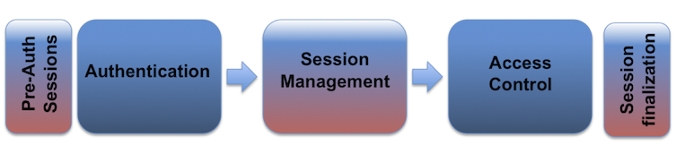

# Manajemen Sesi

## Pengenalan Manajemen Sesi

**Autentikasi Web, Manajemen Sesi, dan Kontrol Akses**:

Sesi web adalah serangkaian transaksi permintaan dan respons HTTP jaringan yang terkait dengan pengguna yang sama. Aplikasi web modern dan kompleks memerlukan penyimpanan informasi atau status tentang setiap pengguna selama beberapa permintaan. Oleh karena itu, sesi menyediakan kemampuan untuk menetapkan variabel – seperti hak akses dan pengaturan lokal – yang akan berlaku untuk setiap interaksi yang dilakukan pengguna dengan aplikasi web selama sesi berlangsung.

Aplikasi web dapat membuat sesi untuk melacak pengguna anonim setelah permintaan pengguna yang pertama. Contohnya adalah menjaga preferensi bahasa pengguna. Selain itu, aplikasi web akan menggunakan sesi setelah pengguna telah melakukan otentikasi. Ini memastikan kemampuan untuk mengidentifikasi pengguna pada permintaan berikutnya serta dapat menerapkan kontrol akses keamanan, akses yang diizinkan ke data pribadi pengguna, dan meningkatkan kegunaan aplikasi. Oleh karena itu, aplikasi web saat ini dapat menyediakan kemampuan sesi baik sebelum maupun setelah autentikasi.

Setelah sesi yang terautentikasi telah dibuat, ID sesi (atau token) sementara setara dengan metode autentikasi terkuat yang digunakan oleh aplikasi, seperti nama pengguna dan kata sandi, frasa sandi, kata sandi sekali pakai (OTP), sertifikat digital berbasis klien, kartu pintar, atau biometrik. (such as fingerprint or eye retina). Lihat OWASP **Lembar Curang Autentikasi**.

HTTP adalah protokol tanpa status ([RFC2616](https://www.ietf.org/rfc/rfc2616.txt) bagian 5), di mana setiap pasangan permintaan dan respons tidak bergantung pada interaksi web lainnya. Oleh karena itu, untuk memperkenalkan konsep sesi, diperlukan untuk mengimplementasikan kemampuan manajemen sesi yang menghubungkan modul autentikasi dan kontrol akses (atau otorisasi) yang umumnya tersedia dalam aplikasi web:

ID sesi atau token mengikat kredensial otentikasi pengguna (dalam bentuk sesi pengguna) ke lalu lintas HTTP pengguna dan kontrol akses yang sesuai yang diterapkan oleh aplikasi web. Kompleksitas ketiga komponen ini (autentikasi, manajemen sesi, dan kontrol akses) dalam aplikasi web modern, ditambah dengan fakta bahwa implementasi dan pengikatannya berada di tangan pengembang web (karena kerangka pengembangan web tidak menyediakan hubungan yang ketat antara modul-modul ini), membuat implementasi modul manajemen sesi yang aman sangat menantang.

Pengungkapan, penangkapan, prediksi, serangan brute force, atau perbaikan ID sesi akan mengarah pada serangan pembajakan sesi (atau sidejacking), di mana seorang penyerang dapat sepenuhnya menyamar sebagai pengguna korban dalam aplikasi web. Penyerang dapat melakukan dua jenis serangan pembajakan sesi, yaitu yang ditargetkan atau generik. Dalam serangan yang ditargetkan, tujuan penyerang adalah untuk menyamar sebagai pengguna korban aplikasi web tertentu (atau yang memiliki hak istimewa). Untuk serangan generik, tujuan penyerang adalah untuk menyamar (atau mendapatkan akses sebagai) pengguna valid atau sah mana pun dalam aplikasi web.

## Properti ID Sesi

Untuk menjaga status terautentikasi dan melacak kemajuan pengguna dalam aplikasi web, aplikasi menyediakan pengguna dengan **pengidentifikasi sesi** (session ID atau token) yang diberikan pada saat pembuatan sesi, dan dibagikan serta ditukar oleh pengguna dan aplikasi web selama sesi berlangsung. (it is sent on every HTTP request). ID sesi adalah pasangan `name=value`.

Dengan tujuan menerapkan ID sesi yang aman, pembuatan pengidentifikasi (ID atau token) harus memenuhi sifat-sifat berikut.

### Pencetakan Nama ID Sesi

Nama yang digunakan oleh ID sesi tidak boleh terlalu deskriptif atau menawarkan detail yang tidak perlu tentang tujuan dan makna dari ID tersebut.

Nama ID sesi yang digunakan oleh kerangka pengembangan aplikasi web yang paling umum [dapat dengan mudah dikenali](https://wiki.owasp.org/index.php/Category:OWASP_Cookies_Database), seperti `PHPSESSID` (PHP), `JSESSIONID` (J2EE), `CFID` & `CFTOKEN` (ColdFusion), `ASP.NET_SessionId` (ASP .NET), dll. Oleh karena itu, nama ID sesi dapat mengungkapkan teknologi dan bahasa pemrograman yang digunakan oleh aplikasi web.

Disarankan untuk mengubah nama ID sesi default dari kerangka pengembangan web menjadi nama generik, seperti `id`.

### Entropi ID Sesi

Pengidentifikasi sesi harus memiliki setidaknya `64 bit` entropi untuk mencegah serangan tebak sesi dengan brute-force. Entropi mengacu pada jumlah kebetulan atau ketidakpastian dalam suatu nilai. Setiap "bit" entropi menggandakan jumlah kemungkinan hasil, yang berarti ID sesi dengan 64 bit entropi dapat memiliki `2^64` nilai yang mungkin.

Sebuah [CSPRNG](https://en.wikipedia.org/wiki/Cryptographically_secure_pseudorandom_number_generator) (Penghasil Angka Pseudorandom yang Aman Secara Kriptografi) yang kuat harus digunakan untuk menghasilkan ID sesi. Ini memastikan nilai yang dihasilkan terdistribusi secara merata di antara semua nilai yang mungkin. Jika tidak, penyerang mungkin dapat menggunakan teknik analisis statistik untuk mengidentifikasi pola dalam cara ID sesi dibuat, secara efektif mengurangi entropi dan memungkinkan penyerang untuk menebak atau memprediksi ID sesi yang valid dengan lebih mudah.

**CATATAN**:

- Waktu yang diharapkan bagi seorang penyerang untuk melakukan brute-force pada ID sesi yang valid tergantung pada faktor-faktor seperti jumlah bit entropi, jumlah sesi aktif, waktu kedaluwarsa sesi, dan tingkat tebakan penyerang.
- Waktu yang diharapkan bagi seorang penyerang untuk melakukan brute-force pada ID sesi yang valid tergantung pada faktor-faktor seperti jumlah bit entropi, jumlah sesi aktif, waktu kedaluwarsa sesi, dan tingkat tebakan penyerang. - Jika sebuah aplikasi web menghasilkan ID sesi dengan 64 bit entropi, seorang penyerang dapat mengharapkan menghabiskan sekitar 585 tahun untuk berhasil menebak ID sesi yang valid, dengan asumsi penyerang dapat mencoba 10.000 tebakan per detik dengan 100.000 sesi simultan yang valid tersedia dalam aplikasi. Jika sebuah aplikasi web menghasilkan ID sesi dengan 64 bit entropi, seorang penyerang dapat mengharapkan untuk menghabiskan sekitar 585 tahun untuk berhasil menebak ID sesi yang valid, dengan asumsi penyerang dapat mencoba 10.000 tebakan per detik dengan 100.000 sesi simultan yang valid tersedia dalam aplikasi.
- Analisis lebih lanjut tentang waktu yang diharapkan bagi penyerang untuk melakukan brute-force pada pengenal sesi tersedia [di sini](https://owasp.org/www-community/vulnerabilities/Insufficient_Session-ID_Length#estimating-attack-time).

### Panjang ID Sesi

Seperti yang disebutkan dalam bagian *Entropi ID Sesi* sebelumnya, persyaratan keamanan utama untuk ID sesi adalah bahwa mereka harus mengandung setidaknya `64 bit` entropi untuk mencegah serangan tebak-tebakan brute-force. Meskipun panjang ID sesi penting, entropi yang memastikan keamanan. ID sesi harus cukup panjang untuk mengenkode entropi yang cukup, mencegah serangan brute force di mana penyerang menebak ID sesi yang valid.

Metode pengkodean yang berbeda dapat menghasilkan panjang yang berbeda untuk jumlah entropi yang sama. ID sesi sering kali direpresentasikan menggunakan pengkodean heksadesimal. Saat menggunakan pengkodean heksadesimal, ID sesi harus memiliki panjang setidaknya 16 karakter heksadesimal untuk mencapai 64 bit entropi yang diperlukan.  Ketika menggunakan pengkodean yang berbeda (misalnya, Base64 atau [pengkodean Microsoft untuk ID sesi ASP.NET](https://docs.microsoft.com/en-us/dotnet/api/system.web.sessionstate.sessionidmanager?redirectedfrom=MSDN&view=netframework-4.7.2)), jumlah karakter yang berbeda mungkin diperlukan untuk mewakili minimum 64 bit entropi.

Penting untuk dicatat bahwa jika ada bagian dari ID sesi yang tetap atau dapat diprediksi, entropi efektifnya berkurang, dan panjangnya mungkin perlu ditingkatkan untuk mengkompensasi. Misalnya, jika setengah dari ID sesi heksadesimal 16 karakter tetap, hanya 8 karakter yang tersisa yang acak, memberikan hanya 32 bit entropi — yang tidak cukup untuk keamanan yang kuat. Untuk menjaga keamanan, pastikan bahwa seluruh ID sesi dihasilkan secara acak dan tidak dapat diprediksi, atau tingkatkan panjang keseluruhan jika sebagian dari ID tidak acak.

**CATATAN**:

- Informasi lebih lanjut tentang hubungan antara Panjang ID Sesi dan Entropi ID Sesi tersedia [di sini](https://owasp.org/www-community/vulnerabilities/Insufficient_Session-ID_Length#session-id-length-and-entropy-relationship).

### Konten ID Sesi (or Value)

Konten (atau nilai) ID sesi harus tidak berarti untuk mencegah serangan pengungkapan informasi, di mana penyerang dapat mendekode konten ID dan mengekstrak detail pengguna, sesi, atau cara kerja internal aplikasi web.

ID sesi harus hanya menjadi pengidentifikasi di sisi klien, dan nilainya tidak boleh pernah menyertakan informasi sensitif atau Informasi Pribadi yang Dapat Diidentifikasi (PII). Untuk membaca lebih lanjut tentang PII, silakan merujuk ke [Wikipedia](https://en.wikipedia.org/wiki/Personally_identifiable_information) atau [posting ini](https://www.idshield.com/blog/identity-theft/what-pii-and-why-should-i-care/).

Makna dan logika bisnis atau aplikasi yang terkait dengan ID sesi harus disimpan di sisi server, dan secara khusus, dalam objek sesi atau dalam basis data atau repositori manajemen sesi.

Informasi yang disimpan dapat mencakup alamat IP klien, User-Agent, email, nama pengguna, ID pengguna, peran, tingkat hak istimewa, hak akses, preferensi bahasa, ID akun, status saat ini, login terakhir, waktu habis sesi, dan detail sesi internal lainnya. Jika objek dan properti sesi mengandung informasi sensitif, seperti nomor kartu kredit, diperlukan untuk mengenkripsi dan melindungi repositori manajemen sesi dengan baik.

Disarankan untuk menggunakan ID sesi yang dibuat oleh bahasa atau kerangka kerja Anda. Jika Anda perlu membuat sessionID Anda sendiri, gunakan generator angka pseudorandom yang aman secara kriptografi (CSPRNG) dengan ukuran setidaknya 128 bit dan pastikan setiap sessionID unik.

## Implementasi Manajemen Sesi

Implementasi manajemen sesi mendefinisikan mekanisme pertukaran yang akan digunakan antara pengguna dan aplikasi web untuk berbagi dan terus-menerus bertukar ID sesi. Ada beberapa mekanisme yang tersedia dalam HTTP untuk mempertahankan status sesi dalam aplikasi web, seperti cookie (header HTTP standar), parameter URL (penulisan ulang URL – [RFC2396](https://www.ietf.org/rfc/rfc2396.txt)), argumen URL pada permintaan GET, argumen body pada permintaan POST, seperti field formulir tersembunyi (formulir HTML), atau header HTTP proprietary.

Mekanisme pertukaran ID sesi yang diutamakan harus memungkinkan penentuan properti token yang lebih lanjut, seperti tanggal dan waktu kedaluwarsa token, atau batasan penggunaan yang lebih rinci. Ini adalah salah satu alasan mengapa cookie (RFCs [2109](https://www.ietf.org/rfc/rfc2109.txt) & [2965](https://www.ietf.org/rfc/rfc2965.txt) & [6265](https://www.ietf.org/rfc/rfc6265.txt)) adalah salah satu mekanisme pertukaran ID sesi yang paling banyak digunakan, menawarkan kemampuan canggih yang tidak tersedia dalam metode lain.

Penggunaan mekanisme pertukaran ID sesi tertentu, seperti yang di mana ID disertakan dalam URL, dapat mengungkapkan ID sesi (dalam tautan web dan log, riwayat dan bookmark browser web, header Referer atau mesin pencari), serta memfasilitasi serangan lain, seperti manipulasi ID atau [serangan penetapan sesi](http://www.acrossecurity.com/papers/session_fixation.pdf).

### Implementasi Manajemen Sesi Bawaan

Kerangka kerja pengembangan web, seperti J2EE, ASP .NET, PHP, dan lainnya, menyediakan fitur manajemen sesi mereka sendiri dan implementasi terkait. Disarankan untuk menggunakan kerangka kerja bawaan ini dibandingkan membuatnya sendiri dari awal, karena mereka digunakan di seluruh dunia di berbagai lingkungan web dan telah diuji oleh komunitas keamanan dan pengembangan aplikasi web seiring waktu.

Namun, perlu diketahui bahwa kerangka kerja ini juga telah menunjukkan kerentanan dan kelemahan di masa lalu, jadi selalu disarankan untuk menggunakan versi terbaru yang tersedia, yang berpotensi memperbaiki semua kerentanan yang dikenal, serta meninjau dan mengubah konfigurasi default untuk meningkatkan keamanannya dengan mengikuti rekomendasi yang dijelaskan dalam dokumen ini.

Kemampuan penyimpanan atau repositori yang digunakan oleh mekanisme manajemen sesi untuk menyimpan sementara ID sesi harus aman, melindungi ID sesi dari pengungkapan tidak sengaja lokal atau jarak jauh atau akses tidak sah.

### Mekanisme Pertukaran ID Sesi yang Digunakan vs. Diterima

Sebuah aplikasi web harus menggunakan cookie untuk manajemen pertukaran ID sesi. Jika seorang pengguna mengirimkan ID sesi melalui mekanisme pertukaran yang berbeda, seperti parameter URL, aplikasi web harus menghindari menerimanya sebagai bagian dari strategi defensif untuk menghentikan peretasan sesi.

**CATATAN**:

- Meskipun aplikasi web menggunakan cookie sebagai mekanisme pertukaran ID sesi defaultnya, aplikasi tersebut mungkin juga menerima mekanisme pertukaran lainnya.
- Meskipun aplikasi web menggunakan cookie sebagai mekanisme pertukaran ID sesi defaultnya, aplikasi tersebut mungkin juga menerima mekanisme pertukaran lainnya. - Oleh karena itu, diperlukan konfirmasi melalui pengujian menyeluruh semua mekanisme berbeda yang saat ini diterima oleh aplikasi web saat memproses dan mengelola ID sesi, dan membatasi mekanisme pelacakan ID sesi yang diterima hanya pada cookie. Oleh karena itu, diperlukan untuk mengonfirmasi melalui pengujian menyeluruh semua mekanisme berbeda yang saat ini diterima oleh aplikasi web saat memproses dan mengelola ID sesi, dan membatasi mekanisme pelacakan ID sesi yang diterima hanya pada cookie.
- Dulu, beberapa aplikasi web menggunakan parameter URL, atau bahkan beralih dari cookie ke parameter URL (melalui penulisan ulang URL otomatis), jika kondisi tertentu terpenuhi. (for example, the identification of web clients without support for cookies or not accepting cookies due to user privacy concerns).

### Keamanan Transport Layer

Untuk melindungi pertukaran ID sesi dari penyadapan aktif dan pengungkapan pasif dalam lalu lintas jaringan, sangat penting untuk menggunakan koneksi HTTPS (TLS) terenkripsi untuk seluruh sesi web, bukan hanya untuk proses otentikasi di mana kredensial pengguna dipertukarkan. Ini dapat diminimalkan dengan **HTTP Strict Transport Security (HSTS)** untuk klien yang mendukungnya.

Selain itu, atribut `Secure` [cookie](https://developer.mozilla.org/en-US/docs/Web/HTTP/Cookies#Secure_and_HttpOnly_cookies) harus digunakan untuk memastikan ID sesi hanya dipertukarkan melalui saluran terenkripsi. Penggunaan saluran komunikasi yang terenkripsi juga melindungi sesi dari beberapa serangan session fixation di mana penyerang dapat mencegat dan memanipulasi lalu lintas web untuk menyuntikkan (atau memperbaiki) ID sesi di browser web korban (lihat [di sini](https://media.blackhat.com/bh-eu-11/Raul_Siles/BlackHat_EU_2011_Siles_SAP_Session-Slides.pdf) dan [di sini](https://media.blackhat.com/bh-eu-11/Raul_Siles/BlackHat_EU_2011_Siles_SAP_Session-WP.pdf)).

Serangkaian praktik terbaik berikut difokuskan pada perlindungan ID sesi (khususnya saat cookie digunakan) dan membantu dengan integrasi HTTPS dalam aplikasi web:

- Jangan beralih dari sesi tertentu dari HTTP ke HTTPS, atau sebaliknya, karena ini akan mengungkapkan ID sesi secara jelas melalui jaringan.
    - Saat mengalihkan ke HTTPS, pastikan bahwa cookie diatur atau dibuat ulang **setelah** pengalihan terjadi.
- Jangan mencampur konten terenkripsi dan tidak terenkripsi (halaman HTML, gambar, CSS, file JavaScript, dll) di halaman yang sama, atau dari domain yang sama.
- Jika memungkinkan, hindari menawarkan konten publik yang tidak terenkripsi dan konten pribadi yang terenkripsi dari host yang sama. Jika konten yang tidak aman diperlukan, pertimbangkan untuk menghostingnya di domain tidak aman yang terpisah.
- Terapkan **HTTP Strict Transport Security (HSTS)** untuk menegakkan koneksi HTTPS.

Lihat OWASP **Transport Layer Security Cheat Sheet** untuk panduan umum lebih lanjut tentang menerapkan TLS dengan aman.

Penting untuk menekankan bahwa TLS tidak melindungi terhadap prediksi ID sesi, serangan brute force, manipulasi sisi klien, atau pemfiksasian; namun, TLS memberikan perlindungan yang efektif terhadap penyerang yang mencegat atau mencuri ID sesi melalui serangan man in the middle.

## Cookie

Mekanisme pertukaran ID sesi berbasis cookie menyediakan berbagai fitur keamanan dalam bentuk atribut cookie yang dapat digunakan untuk melindungi pertukaran ID sesi:

### Atribut Aman

Atribut cookie `Secure` menginstruksikan browser web untuk hanya mengirim cookie melalui koneksi HTTPS (SSL/TLS) yang terenkripsi. Mekanisme perlindungan sesi ini wajib untuk mencegah pengungkapan ID sesi melalui serangan MitM (Man-in-the-Middle). Ini memastikan bahwa penyerang tidak dapat dengan mudah menangkap ID sesi dari lalu lintas browser web.

Memaksa aplikasi web untuk hanya menggunakan HTTPS untuk komunikasinya (bahkan ketika port TCP/80, HTTP, ditutup di host aplikasi web) tidak melindungi terhadap pengungkapan ID sesi jika cookie `Secure` belum diatur - peramban web dapat ditipu untuk mengungkapkan ID sesi melalui koneksi HTTP yang tidak terenkripsi. Penyerang dapat mencegat dan memanipulasi lalu lintas pengguna korban serta menyuntikkan referensi HTTP yang tidak terenkripsi ke aplikasi web yang akan memaksa browser web untuk mengirimkan ID sesi dalam bentuk jelas.

Lihat juga: [SecureFlag](https://developer.mozilla.org/en-US/docs/Web/HTTP/Cookies#Secure_and_HttpOnly_cookies)

### Atribut HttpOnly

Atribut cookie `HttpOnly` menginstruksikan browser web untuk tidak mengizinkan skrip (misalnya JavaScript atau VBscript) mengakses cookie melalui objek DOM document.cookie. Perlindungan ID sesi ini wajib untuk mencegah pencurian ID sesi melalui serangan XSS. Namun, jika serangan XSS digabungkan dengan serangan CSRF, permintaan yang dikirim ke aplikasi web akan menyertakan cookie sesi, karena browser selalu menyertakan cookie saat mengirim permintaan. Cookie `HttpOnly` hanya melindungi kerahasiaan cookie; penyerang tidak dapat menggunakannya secara offline, di luar konteks serangan XSS.

Lihat OWASP **XSS (Cross Site Scripting) Prevention Cheat Sheet**.

Lihat juga: [HttpOnly](https://developer.mozilla.org/en-US/docs/Web/HTTP/Cookies#Secure_and_HttpOnly_cookies)

### Atribut SameSite

SameSite mendefinisikan atribut cookie yang mencegah browser mengirimkan cookie yang ditandai SameSite dengan permintaan lintas situs. Tujuan utamanya adalah untuk mengurangi risiko kebocoran informasi lintas asal, dan memberikan perlindungan terhadap serangan pemalsuan permintaan lintas situs.

Lihat juga: [SameSite](https://developer.mozilla.org/en-US/docs/Web/HTTP/Cookies#SameSite_cookies)

### Atribut Domain dan Path

Atribut cookie [`Domain`](https://developer.mozilla.org/en-US/docs/Web/HTTP/Headers/Set-Cookie#Directives) menginstruksikan browser web untuk hanya mengirim cookie ke domain yang ditentukan dan semua subdomain. Jika atribut tidak diatur, secara default cookie hanya akan dikirim ke server asal. Atribut cookie [`Path`](https://developer.mozilla.org/en-US/docs/Web/HTTP/Headers/Set-Cookie#Directives) menginstruksikan browser web untuk hanya mengirim cookie ke direktori atau subdirektori (atau jalur atau sumber daya) yang ditentukan dalam aplikasi web. Jika atribut tidak diatur, secara default cookie hanya akan dikirim untuk direktori (atau jalur) dari sumber daya yang diminta dan pengaturan cookie.

Disarankan untuk menggunakan cakupan yang sempit atau terbatas untuk kedua atribut ini. Dengan cara ini, atribut `Domain` tidak boleh diatur (membatasi cookie hanya pada server asal) dan atribut `Path` harus diatur seketat mungkin pada jalur aplikasi web yang menggunakan ID sesi.

Mengatur atribut `Domain` ke nilai yang terlalu permisif, seperti `example.com`, memungkinkan penyerang untuk meluncurkan serangan pada ID sesi antara host dan aplikasi web yang berbeda yang termasuk dalam domain yang sama, yang dikenal sebagai cookie lintas-subdomain. Misalnya, kerentanan di `www.example.com` mungkin memungkinkan penyerang untuk mendapatkan akses ke ID sesi dari `secure.example.com`.

Selain itu, disarankan untuk tidak mencampur aplikasi web dengan tingkat keamanan yang berbeda pada domain yang sama. Kerentanan dalam salah satu aplikasi web akan memungkinkan penyerang untuk mengatur ID sesi untuk aplikasi web lain di domain yang sama dengan menggunakan atribut `Domain` yang permisif (seperti `example.com`), yang merupakan teknik yang dapat digunakan dalam [serangan fixation sesi](http://www.acrossecurity.com/papers/session_fixation.pdf).

Meskipun atribut `Path` memungkinkan isolasi ID sesi antara aplikasi web yang berbeda menggunakan jalur yang berbeda pada host yang sama, sangat disarankan untuk tidak menjalankan aplikasi web yang berbeda (terutama dari tingkat atau cakupan keamanan yang berbeda) pada host yang sama. Metode lain dapat digunakan oleh aplikasi-aplikasi ini untuk mengakses ID sesi, seperti objek `document.cookie`. Selain itu, aplikasi web mana pun dapat mengatur cookie untuk jalur mana pun di host tersebut.

Cookie rentan terhadap serangan spoofing/hijacking/poisoning DNS, di mana penyerang dapat memanipulasi resolusi DNS untuk memaksa browser web mengungkapkan ID sesi untuk host atau domain tertentu.

### Atribut Expire dan Max-Age

Mekanisme manajemen sesi berbasis cookie dapat menggunakan dua jenis cookie, cookie non-persisten (atau sesi) dan cookie persisten. Jika sebuah cookie memiliki atribut [`Max-Age`](https://developer.mozilla.org/en-US/docs/Web/HTTP/Headers/Set-Cookie#Directives) (yang memiliki preferensi lebih tinggi daripada `Expires`) atau atribut [`Expires`](https://developer.mozilla.org/en-US/docs/Web/HTTP/Headers/Set-Cookie#Directives), itu akan dianggap sebagai cookie persisten dan akan disimpan di disk oleh browser web hingga waktu kedaluwarsa.

Biasanya, kemampuan manajemen sesi untuk melacak pengguna setelah otentikasi menggunakan cookie non-berkelanjutan. Ini memaksa sesi untuk menghilang dari klien jika instance browser web saat ini ditutup. Oleh karena itu, sangat dianjurkan untuk menggunakan cookie non-persistent untuk tujuan manajemen sesi, sehingga ID sesi tidak tetap berada di cache klien web untuk jangka waktu yang lama, dari mana seorang penyerang dapat memperolehnya.

- Pastikan bahwa informasi sensitif tidak dikompromikan dengan memastikan bahwa informasi tersebut tidak persisten, mengenkripsinya, dan menyimpannya hanya selama diperlukan
- Pastikan bahwa aktivitas yang tidak sah tidak dapat dilakukan melalui manipulasi cookie
- Pastikan bendera aman diatur untuk mencegah transmisi tidak sengaja melalui jaringan dengan cara yang tidak aman
- Tentukan apakah semua transisi status dalam kode aplikasi memeriksa cookie dengan benar dan menegakkan penggunaannya
- Pastikan seluruh cookie harus dienkripsi jika data sensitif disimpan dalam cookie
- Definisikan semua cookie yang digunakan oleh aplikasi, nama mereka, dan mengapa mereka diperlukan

## API Penyimpanan Web HTML5

Kelompok Kerja Teknologi Aplikasi Hypertext Web (WHATWG) menggambarkan API Web Storage HTML5, `localStorage` dan `sessionStorage`, sebagai mekanisme untuk menyimpan pasangan nama-nilai di sisi klien.
Tidak seperti cookie HTTP, konten dari `localStorage` dan `sessionStorage` tidak secara otomatis dibagikan dalam permintaan atau respons oleh browser dan digunakan untuk menyimpan data di sisi klien.

### API localStorage

#### Lingkup

Data yang disimpan menggunakan API `localStorage` dapat diakses oleh halaman yang dimuat dari asal yang sama, yang didefinisikan sebagai skema (`https://`), host (`example.com`), port (`443`), dan domain/realm (`example.com`).
Ini memberikan akses yang mirip ke data ini seperti yang akan dicapai dengan menggunakan bendera `secure` pada cookie, yang berarti bahwa data yang disimpan dari `https` tidak dapat diambil melalui `http`. Karena potensi akses bersamaan dari jendela/benang terpisah, data yang disimpan menggunakan `localStorage` mungkin rentan terhadap masalah akses bersama (seperti kondisi balapan) dan harus dianggap tidak mengunci ([Spesifikasi API Penyimpanan Web](https://html.spec.whatwg.org/multipage/webstorage.html#the-localstorage-attribute)).

#### Durasi

Data yang disimpan menggunakan API `localStorage` dipertahankan di antara sesi penjelajahan, memperpanjang jangka waktu di mana data tersebut dapat diakses oleh pengguna sistem lainnya.

#### Akses Offline

Standar tidak mengharuskan data `localStorage` untuk dienkripsi saat tidak digunakan, yang berarti mungkin saja data ini dapat diakses langsung dari disk.

#### Kasus Penggunaan

WHATWG menyarankan penggunaan `localStorage` untuk data yang perlu diakses di berbagai jendela atau tab, di berbagai sesi, dan di mana volume data besar (multi-megabyte) mungkin perlu disimpan demi alasan kinerja.

### API sessionStorage

#### Ruang Lingkup

API `sessionStorage` menyimpan data dalam konteks jendela dari mana ia dipanggil, yang berarti Tab 1 tidak dapat mengakses data yang disimpan dari Tab 2.
Juga, seperti API `localStorage`, data yang disimpan menggunakan API `sessionStorage` dapat diakses oleh halaman yang dimuat dari asal yang sama, yang didefinisikan sebagai skema (`https://`), host (`example.com`), port (`443`), dan domain/realm (`example.com`).
Ini memberikan akses serupa ke data ini seperti yang akan dicapai dengan menggunakan flag `secure` pada cookie, yang berarti bahwa data yang disimpan dari `https` tidak dapat diambil melalui `http`.

#### Durasi

API `sessionStorage` hanya menyimpan data selama sesi penelusuran saat ini. Setelah tab ditutup, data tersebut tidak dapat diambil lagi. Ini tidak serta merta mencegah akses, jika tab browser digunakan kembali atau dibiarkan terbuka. Data juga dapat tetap ada di memori hingga terjadi peristiwa pengumpulan sampah.

#### Akses Offline

Standar tidak mengharuskan data `sessionStorage` untuk dienkripsi saat tidak digunakan, yang berarti mungkin saja data ini dapat diakses langsung dari disk.

#### Kasus Penggunaan

WHATWG menyarankan penggunaan `sessionStorage` untuk data yang relevan untuk satu-instance dari alur kerja, seperti detail untuk pemesanan tiket, tetapi di mana beberapa alur kerja dapat dilakukan di tab lain secara bersamaan. Sifat terikat pada jendela/tab akan mencegah data bocor antara alur kerja di tab yang terpisah.

### Referensi

- [Web Storage APIs](https://developer.mozilla.org/en-US/docs/Web/API/Web_Storage_API/Using_the_Web_Storage_API)
- [API LocalStorage](https://developer.mozilla.org/en-US/docs/Web/API/Window/localStorage)
- [API SessionStorage](https://developer.mozilla.org/en-US/docs/Web/API/Window/sessionStorage)
- [Spesifikasi Web Storage WHATWG](https://html.spec.whatwg.org/multipage/webstorage.html#webstorage)

## Pekerja Web

Web Workers menjalankan kode JavaScript dalam konteks global yang terpisah dari jendela saat ini. Sebuah saluran komunikasi dengan jendela eksekusi utama ada, yang disebut `MessageChannel`.

### Kasus Penggunaan

Web Workers adalah alternatif untuk penyimpanan rahasia (sesi) di browser ketika ketahanan penyimpanan setelah penyegaran halaman bukanlah persyaratan. Agar Web Workers menyediakan penyimpanan browser yang aman, setiap kode yang memerlukan rahasia harus ada di dalam Web Worker dan rahasia tersebut tidak boleh pernah dikirimkan ke konteks jendela utama.

Menyimpan rahasia dalam memori Web Worker menawarkan jaminan keamanan yang sama seperti cookie HttpOnly: kerahasiaan rahasia tersebut terlindungi. Namun, serangan XSS dapat digunakan untuk mengirim pesan ke Web Worker untuk melakukan operasi yang memerlukan rahasia tersebut. Web Worker akan mengembalikan hasil operasi ke thread eksekusi utama.

Keuntungan dari implementasi Web Worker dibandingkan dengan cookie HttpOnly adalah bahwa Web Worker memungkinkan beberapa kode JavaScript terisolasi untuk mengakses rahasia tersebut; cookie HttpOnly tidak dapat diakses oleh JavaScript mana pun. Jika kode JavaScript frontend memerlukan akses ke rahasia tersebut, implementasi Web Worker adalah satu-satunya opsi penyimpanan browser yang menjaga kerahasiaan rahasia tersebut.

## Siklus Hidup ID Sesi

### Pembuatan dan Verifikasi ID Sesi: Manajemen Sesi Permisif dan Ketat

Ada dua jenis mekanisme manajemen sesi untuk aplikasi web, permisif dan ketat, yang terkait dengan kerentanan perbaikan sesi. Mekanisme permisif memungkinkan aplikasi web untuk awalnya menerima nilai ID sesi apa pun yang ditetapkan oleh pengguna sebagai valid, menciptakan sesi baru untuknya, sementara mekanisme ketat menegakkan bahwa aplikasi web hanya akan menerima nilai ID sesi yang telah dihasilkan sebelumnya oleh aplikasi web.

Token sesi harus ditangani oleh server web jika memungkinkan atau dihasilkan melalui generator angka acak yang aman secara kriptografi.

Meskipun mekanisme yang paling umum digunakan saat ini adalah yang ketat (lebih aman), [PHP secara default menggunakan mekanisme permisif](https://wiki.php.net/rfc/session-use-strict-mode). Pengembang harus memastikan bahwa aplikasi web tidak menggunakan mekanisme permisif dalam keadaan tertentu. Aplikasi web tidak boleh menerima ID sesi yang tidak pernah mereka buat, dan jika menerima satu, mereka harus menghasilkan dan menawarkan ID sesi valid baru kepada pengguna. Selain itu, skenario ini harus terdeteksi sebagai aktivitas mencurigakan dan sebuah peringatan harus dihasilkan.

### Kelola ID Sesi seperti Input Pengguna Lainnya

ID sesi harus dianggap tidak tepercaya, seperti input pengguna lainnya yang diproses oleh aplikasi web, dan mereka harus divalidasi dan diverifikasi secara menyeluruh. Tergantung pada mekanisme manajemen sesi yang digunakan, ID sesi akan diterima dalam parameter GET atau POST, di URL atau di header HTTP. (e.g. cookies). Jika aplikasi web tidak memvalidasi dan menyaring nilai ID sesi yang tidak valid sebelum memprosesnya, ID sesi tersebut dapat berpotensi digunakan untuk mengeksploitasi kerentanan web lainnya, seperti injeksi SQL jika ID sesi disimpan di database relasional, atau XSS persisten jika ID sesi disimpan dan dipantulkan kembali oleh aplikasi web.

### Perbarui ID Sesi Setelah Perubahan Tingkat Hak Akses

ID sesi harus diperbarui atau dihasilkan kembali oleh aplikasi web setelah ada perubahan tingkat hak istimewa dalam sesi pengguna yang terkait. Skenario paling umum di mana regenerasi ID sesi wajib adalah selama proses otentikasi, karena tingkat hak istimewa pengguna berubah dari keadaan tidak terautentikasi (atau anonim) ke keadaan terautentikasi meskipun dalam beberapa kasus masih belum menjadi keadaan terotorisasi. Skenario umum yang perlu dipertimbangkan termasuk; perubahan kata sandi, perubahan izin, atau beralih dari peran pengguna biasa ke peran administrator dalam aplikasi web. Untuk semua halaman sensitif dari aplikasi web, semua ID sesi sebelumnya harus diabaikan, hanya ID sesi saat ini yang harus ditugaskan untuk setiap permintaan baru yang diterima untuk sumber daya yang dilindungi, dan ID sesi lama atau sebelumnya harus dihancurkan.

Kerangka kerja pengembangan web yang paling umum menyediakan fungsi dan metode sesi untuk memperbarui ID sesi, seperti `request.getSession(true)` & `HttpSession.invalidate()` (J2EE), `Session.Abandon()` & `Response.Cookies.Add(new...)` (ASP .NET), atau `session_start()` & `session_regenerate_id(true)` (PHP).

Regenerasi ID sesi adalah wajib untuk mencegah [serangan perbaikan sesi](http://www.acrossecurity.com/papers/session_fixation.pdf), di mana penyerang mengatur ID sesi pada browser web pengguna korban alih-alih mengumpulkan ID sesi korban, seperti pada sebagian besar serangan berbasis sesi lainnya, dan terlepas dari penggunaan HTTP atau HTTPS. Perlindungan ini mengurangi dampak dari kerentanan berbasis web lainnya yang juga dapat digunakan untuk meluncurkan serangan session fixation, seperti pemisahan respons HTTP atau XSS (lihat [di sini](https://media.blackhat.com/bh-eu-11/Raul_Siles/BlackHat_EU_2011_Siles_SAP_Session-Slides.pdf) dan [di sini](https://media.blackhat.com/bh-eu-11/Raul_Siles/BlackHat_EU_2011_Siles_SAP_Session-WP.pdf)).

Rekomendasi tambahan adalah menggunakan ID sesi atau nama token yang berbeda (atau kumpulan ID sesi) sebelum dan sesudah otentikasi, sehingga aplikasi web dapat melacak pengguna anonim dan pengguna yang terautentikasi tanpa risiko mengekspos atau mengikat sesi pengguna antara kedua keadaan tersebut.

### Pertimbangan Saat Menggunakan Beberapa Cookie

Jika aplikasi web menggunakan cookie sebagai mekanisme pertukaran ID sesi, dan beberapa cookie diatur untuk sesi tertentu, aplikasi web harus memverifikasi semua cookie (dan menegakkan hubungan antara mereka) sebelum mengizinkan akses ke sesi pengguna.

Sangat umum bagi aplikasi web untuk mengatur cookie pengguna pra-autentikasi melalui HTTP untuk melacak pengguna yang tidak terautentikasi (atau anonim). Setelah pengguna melakukan otentikasi di aplikasi web, cookie aman pasca-otentikasi baru diatur melalui HTTPS, dan ikatan antara kedua cookie dan sesi pengguna dibuat. Jika aplikasi web tidak memverifikasi kedua cookie untuk sesi yang terautentikasi, seorang penyerang dapat memanfaatkan cookie yang tidak terlindungi sebelum autentikasi untuk mendapatkan akses ke sesi pengguna yang terautentikasi (lihat [di sini](https://media.blackhat.com/bh-eu-11/Raul_Siles/BlackHat_EU_2011_Siles_SAP_Session-Slides.pdf) dan [di sini](https://media.blackhat.com/bh-eu-11/Raul_Siles/BlackHat_EU_2011_Siles_SAP_Session-WP.pdf)).

Aplikasi web harus mencoba menghindari penggunaan nama cookie yang sama untuk jalur atau cakupan domain yang berbeda dalam aplikasi web yang sama, karena ini meningkatkan kompleksitas solusi dan berpotensi memperkenalkan masalah cakupan.

## Kedaluwarsa Sesi

Untuk meminimalkan periode waktu di mana penyerang dapat meluncurkan serangan terhadap sesi aktif dan membajak sesi tersebut, wajib untuk menetapkan batas waktu kedaluwarsa untuk setiap sesi, menetapkan jumlah waktu sesi akan tetap aktif. Kedaluwarsa sesi yang tidak memadai oleh aplikasi web meningkatkan paparan terhadap serangan berbasis sesi lainnya, karena agar penyerang dapat menggunakan kembali ID sesi yang valid dan membajak sesi terkait, sesi tersebut harus tetap aktif.

Semakin pendek interval sesi, semakin sedikit waktu yang dimiliki penyerang untuk menggunakan ID sesi yang valid. Nilai waktu kedaluwarsa sesi harus diatur sesuai dengan tujuan dan sifat aplikasi web, serta menyeimbangkan keamanan dan kegunaan, sehingga pengguna dapat dengan nyaman menyelesaikan operasi dalam aplikasi web tanpa sesi mereka sering kedaluwarsa.

Baik nilai idle maupun absolute timeout sangat bergantung pada seberapa kritis aplikasi web dan datanya. Rentang waktu idle yang umum adalah 2-5 menit untuk aplikasi bernilai tinggi dan 15-30 menit untuk aplikasi berisiko rendah. Timeout absolut tergantung pada seberapa lama pengguna biasanya menggunakan aplikasi tersebut. Jika aplikasi tersebut dimaksudkan untuk digunakan oleh pekerja kantor sepanjang hari, rentang waktu habis absolut yang sesuai bisa antara 4 hingga 8 jam.

Ketika sesi berakhir, aplikasi web harus mengambil tindakan aktif untuk membatalkan sesi di kedua sisi, klien dan server. Yang terakhir adalah yang paling relevan dan wajib dari perspektif keamanan.

Untuk sebagian besar mekanisme pertukaran sesi, tindakan di sisi klien untuk membatalkan ID sesi didasarkan pada menghapus nilai token. Misalnya, untuk membatalkan cookie disarankan untuk memberikan nilai kosong (atau tidak valid) untuk ID sesi, dan mengatur atribut `Expires` (atau `Max-Age`) ke tanggal dari masa lalu (jika cookie persisten digunakan): `Set-Cookie: id=; Expires=Jumat, 17-Mei-03 18:45:00 GMT`

Untuk menutup dan membatalkan sesi di sisi server, wajib bagi aplikasi web untuk mengambil tindakan aktif ketika sesi berakhir, atau pengguna secara aktif keluar, dengan menggunakan fungsi dan metode yang ditawarkan oleh mekanisme manajemen sesi, seperti `HttpSession.invalidate()` (J2EE), `Session.Abandon()` (ASP .NET) atau `session_destroy()/unset()` (PHP).

### Kedaluwarsa Sesi Otomatis

#### Waktu Habis Karena Tidak Aktif

Semua sesi harus menerapkan waktu habis tidak aktif atau waktu habis karena tidak ada aktivitas. Timeout ini mendefinisikan jumlah waktu sesi akan tetap aktif jika tidak ada aktivitas dalam sesi tersebut, menutup dan membatalkan sesi setelah periode idle yang ditentukan sejak permintaan HTTP terakhir diterima oleh aplikasi web untuk ID sesi tertentu.

Waktu tunggu tidak aktif membatasi peluang seorang penyerang untuk menebak dan menggunakan ID sesi yang valid dari pengguna lain. Namun, jika penyerang berhasil membajak sesi tertentu, batas waktu idle tidak membatasi tindakan penyerang, karena mereka dapat menghasilkan aktivitas pada sesi tersebut secara berkala untuk menjaga sesi tetap aktif dalam jangka waktu yang lebih lama.

Manajemen dan kedaluwarsa timeout sesi harus ditegakkan di sisi server. Jika klien digunakan untuk menegakkan batas waktu sesi, misalnya menggunakan token sesi atau parameter klien lainnya untuk melacak referensi waktu (misalnya jumlah menit sejak waktu login), seorang penyerang dapat memanipulasi ini untuk memperpanjang durasi sesi.

#### Timeout Absolut

Semua sesi harus menerapkan batas waktu absolut, terlepas dari aktivitas sesi. Timeout ini menentukan jumlah maksimum waktu sesi dapat aktif, menutup dan membatalkan sesi setelah periode absolut yang ditentukan sejak sesi tersebut awalnya dibuat oleh aplikasi web. Setelah sesi dinyatakan tidak valid, pengguna dipaksa untuk (meng)autentikasi ulang di aplikasi web dan membuat sesi baru.

Sesi absolut membatasi jumlah waktu yang dapat digunakan penyerang untuk menggunakan sesi yang dibajak dan menyamar sebagai pengguna korban.

#### Batas Waktu Perpanjangan

Sebagai alternatif, aplikasi web dapat menerapkan tambahan waktu pembaruan setelah sesi ID secara otomatis diperbarui, di tengah sesi pengguna, dan secara independen dari aktivitas sesi dan, oleh karena itu, dari waktu tunggu tidak aktif.

Setelah jangka waktu tertentu sejak sesi awal dibuat, aplikasi web dapat menghasilkan ID baru untuk sesi pengguna dan mencoba mengaturnya, atau memperbaruinya, di klien. Nilai ID sesi sebelumnya akan tetap valid untuk beberapa waktu, mengakomodasi interval keamanan, sebelum klien menyadari ID baru dan mulai menggunakannya. Pada saat itu, ketika klien beralih ke ID baru di dalam sesi saat ini, aplikasi membatalkan ID sebelumnya.

Skenario ini meminimalkan jumlah waktu nilai ID sesi tertentu, yang berpotensi diperoleh oleh penyerang, dapat digunakan kembali untuk membajak sesi pengguna, bahkan ketika sesi pengguna korban masih aktif. Sesi pengguna tetap hidup dan terbuka di klien yang sah, meskipun nilai ID sesi yang terkait diperbarui secara transparan secara berkala selama durasi sesi, setiap kali waktu tunggu pembaruan berakhir. Oleh karena itu, waktu tunggu pembaruan melengkapi waktu tunggu idle dan waktu tunggu absolut, terutama ketika nilai waktu tunggu absolut diperpanjang secara signifikan seiring waktu. (e.g. it is an application requirement to keep the user sessions open for long periods of time).

Tergantung pada implementasinya, mungkin ada kondisi balapan di mana penyerang dengan ID sesi sebelumnya yang masih valid mengirimkan permintaan sebelum pengguna korban, tepat setelah waktu tunggu pembaruan baru saja kedaluwarsa, dan terlebih dahulu memperoleh nilai untuk ID sesi yang diperbarui. Setidaknya dalam skenario ini, pengguna korban mungkin menyadari serangan tersebut karena sesi mereka akan tiba-tiba terputus karena ID sesi yang terkait tidak valid lagi.

### Kedaluwarsa Sesi Manual

Aplikasi web harus menyediakan mekanisme yang memungkinkan pengguna yang sadar keamanan untuk secara aktif menutup sesi mereka setelah mereka selesai menggunakan aplikasi web.

#### Tombol Logout

Aplikasi web harus menyediakan tombol logout (logoff, keluar, atau tutup sesi) yang terlihat dan mudah diakses yang tersedia di header atau menu aplikasi web dan dapat dijangkau dari setiap sumber daya dan halaman aplikasi web, sehingga pengguna dapat menutup sesi secara manual kapan saja. Seperti yang dijelaskan dalam bagian *Session_Expiration*, aplikasi web harus membatalkan sesi setidaknya di sisi server.

**CATATAN**: Sayangnya, tidak semua aplikasi web memfasilitasi pengguna untuk menutup sesi mereka saat ini. Dengan demikian, peningkatan sisi klien memungkinkan pengguna yang teliti untuk melindungi sesi mereka dengan membantu menutupnya secara tekun.

### Penyimpanan Konten Web

Bahkan setelah sesi ditutup, mungkin saja untuk mengakses data pribadi atau sensitif yang dipertukarkan dalam sesi tersebut melalui cache browser web. Oleh karena itu, aplikasi web harus menggunakan direktif cache yang ketat untuk semua lalu lintas web yang dipertukarkan melalui HTTP dan HTTPS, seperti header HTTP [`Cache-Control`](https://developer.mozilla.org/en-US/docs/Web/HTTP/Headers/Cache-Control) dan [`Pragma`](https://developer.mozilla.org/en-US/docs/Web/HTTP/Headers/Pragma), dan/atau tag META setara pada semua atau (setidaknya) halaman web yang sensitif.

Terlepas dari kebijakan cache yang ditentukan oleh aplikasi web, jika konten aplikasi web diizinkan untuk di-cache, ID sesi tidak boleh pernah di-cache, jadi sangat disarankan untuk menggunakan direktif `Cache-Control: no-cache="Set-Cookie, Set-Cookie2"`, untuk memungkinkan klien web menyimpan cache semua kecuali ID sesi (lihat [di sini](https://stackoverflow.com/a/41352418)).

## Pertahanan Tambahan Sisi Klien untuk Manajemen Sesi

Aplikasi web dapat melengkapi pertahanan manajemen sesi yang telah dijelaskan sebelumnya dengan langkah-langkah tambahan di sisi klien. Perlindungan sisi klien, biasanya dalam bentuk pemeriksaan dan verifikasi JavaScript, tidak sepenuhnya aman dan dapat dengan mudah dikalahkan oleh penyerang yang terampil, tetapi dapat memperkenalkan lapisan pertahanan tambahan yang harus dilewati oleh penyusup.

### Timeout Login Awal

Aplikasi web dapat menggunakan kode JavaScript di halaman login untuk mengevaluasi dan mengukur jumlah waktu sejak halaman dimuat dan ID sesi diberikan. Jika upaya login dilakukan setelah jangka waktu tertentu, kode klien dapat memberi tahu pengguna bahwa waktu maksimum untuk login telah berlalu dan memuat ulang halaman login, sehingga mendapatkan ID sesi baru.

Mekanisme perlindungan tambahan ini mencoba memaksa pembaruan ID sesi sebelum autentikasi, menghindari skenario di mana ID sesi yang sebelumnya digunakan (atau diatur secara manual) digunakan kembali oleh korban berikutnya yang menggunakan komputer yang sama, misalnya, dalam serangan perbaikan sesi.

### Paksa Logout Sesi Saat Jendela Browser Ditutup Acara Tutup

Aplikasi web dapat menggunakan kode JavaScript untuk menangkap semua peristiwa penutupan (atau bahkan kembali) tab atau jendela peramban web dan mengambil tindakan yang sesuai untuk menutup sesi saat ini sebelum menutup peramban web, meniru bahwa pengguna telah menutup sesi secara manual melalui tombol keluar.

### Nonaktifkan Sesi Lintas Tab Peramban Web

Aplikasi web dapat menggunakan kode JavaScript setelah pengguna masuk dan sesi telah dibuat untuk memaksa pengguna melakukan autentikasi ulang jika tab atau jendela peramban web baru dibuka pada aplikasi web yang sama. Aplikasi web tidak ingin mengizinkan beberapa tab atau jendela peramban web untuk berbagi sesi yang sama. Oleh karena itu, aplikasi mencoba memaksa peramban web untuk tidak berbagi ID sesi yang sama secara bersamaan di antara mereka.

**CATATAN**: Mekanisme ini tidak dapat diimplementasikan jika ID sesi dipertukarkan melalui cookie, karena cookie dibagikan oleh semua tab/jendela peramban web.

### Keluar Otomatis dari Klien

Kode JavaScript dapat digunakan oleh aplikasi web di semua halaman (atau halaman penting) untuk keluar secara otomatis dari sesi klien setelah batas waktu siaga berakhir, misalnya, dengan mengarahkan pengguna ke halaman keluar (sumber daya yang sama yang digunakan oleh tombol keluar yang disebutkan sebelumnya).

Manfaat dari peningkatan fungsionalitas batas waktu siaga sisi server dengan kode sisi klien adalah bahwa pengguna dapat melihat bahwa sesi telah berakhir karena tidak aktif, atau bahkan dapat diberi tahu sebelumnya bahwa sesi akan segera berakhir melalui penghitung waktu mundur dan pesan peringatan. Pendekatan yang mudah digunakan ini membantu menghindari hilangnya pekerjaan di halaman web yang memerlukan data input yang ekstensif karena sesi sisi server yang kedaluwarsa secara diam-diam.

## Deteksi Serangan Sesi

### Tebakan ID Sesi dan Deteksi Brute Force

Jika penyerang mencoba menebak atau melakukan brute force pada ID sesi yang valid, mereka perlu meluncurkan beberapa permintaan berurutan terhadap aplikasi web target menggunakan ID sesi yang berbeda dari satu (atau serangkaian) alamat IP. Selain itu, jika penyerang mencoba menganalisis prediktabilitas ID sesi (misalnya menggunakan analisis statistik), mereka perlu meluncurkan beberapa permintaan berurutan dari satu (atau sekumpulan) alamat IP terhadap aplikasi web target untuk mengumpulkan ID sesi baru yang valid.

Aplikasi web harus dapat mendeteksi kedua skenario berdasarkan jumlah upaya untuk mengumpulkan (atau menggunakan) ID sesi yang berbeda dan memberi peringatan dan/atau memblokir alamat IP yang melanggar.

### Mendeteksi Anomali ID Sesi

Aplikasi web harus fokus pada pendeteksian anomali yang terkait dengan ID sesi, seperti manipulasinya. OWASP [Proyek AppSensor](https://owasp.org/www-project-appsensor/) menyediakan kerangka kerja dan metodologi untuk mengimplementasikan kemampuan deteksi intrusi bawaan dalam aplikasi web yang difokuskan pada pendeteksian anomali dan perilaku tak terduga, dalam bentuk titik deteksi dan tindakan respons. Alih-alih menggunakan lapisan perlindungan eksternal, terkadang detail logika bisnis dan kecerdasan tingkat lanjut hanya tersedia dari dalam aplikasi web, tempat beberapa titik deteksi terkait sesi dapat dibuat, seperti saat cookie yang ada diubah atau dihapus, cookie baru ditambahkan, ID sesi dari pengguna lain digunakan kembali, atau saat lokasi pengguna atau Agen-Pengguna berubah di tengah sesi.

### Mengikat ID Sesi ke Properti Pengguna Lain

Dengan tujuan mendeteksi (dan, dalam beberapa skenario, melindungi dari) perilaku buruk pengguna dan pembajakan sesi, sangat disarankan untuk mengikat ID sesi ke properti pengguna atau klien lain, seperti alamat IP klien, Agen-Pengguna, atau sertifikat digital berbasis klien. Jika aplikasi web mendeteksi perubahan atau anomali apa pun antara properti yang berbeda ini di tengah sesi yang dibuat, ini merupakan indikator yang sangat baik dari manipulasi sesi dan upaya pembajakan, dan fakta sederhana ini dapat digunakan untuk memperingatkan dan/atau menghentikan sesi yang mencurigakan.

Meskipun properti ini tidak dapat digunakan oleh aplikasi web untuk mempertahankan diri dari serangan sesi, properti ini secara signifikan meningkatkan kemampuan deteksi (dan perlindungan) aplikasi web. Namun, penyerang yang terampil dapat melewati kontrol ini dengan menggunakan kembali alamat IP yang sama yang ditetapkan kepada pengguna korban dengan berbagi jaringan yang sama (sangat umum di lingkungan NAT, seperti hotspot Wi-Fi) atau dengan menggunakan proksi web keluar yang sama (sangat umum di lingkungan perusahaan), atau dengan memodifikasi User-Agent miliknya secara manual agar terlihat persis seperti yang dilakukan pengguna korban.

### Siklus Hidup Pencatatan Sesi: Memantau Pembuatan, Penggunaan, dan Penghancuran ID Sesi

Aplikasi web harus meningkatkan kemampuan pencatatannya dengan menyertakan informasi mengenai siklus hidup penuh sesi. Secara khusus, disarankan untuk mencatat kejadian terkait sesi, seperti pembuatan, pembaruan, dan pemusnahan ID sesi, serta detail tentang penggunaannya dalam operasi masuk dan keluar, perubahan tingkat hak istimewa dalam sesi, kedaluwarsa batas waktu, aktivitas sesi yang tidak valid (saat terdeteksi), dan operasi bisnis penting selama sesi.

Detail log mungkin mencakup stempel waktu, alamat IP sumber, sumber daya target web yang diminta (dan terlibat dalam operasi sesi), header HTTP (termasuk User-Agent dan Referer), parameter GET dan POST, kode dan pesan kesalahan, nama pengguna (atau ID pengguna), ditambah ID sesi (cookie, URL, GET, POST…).

Data sensitif seperti ID sesi tidak boleh disertakan dalam log untuk melindungi log sesi terhadap pengungkapan lokal atau jarak jauh ID sesi atau akses tidak sah. Namun, beberapa jenis informasi khusus sesi harus dicatat untuk menghubungkan entri log ke sesi tertentu. Disarankan untuk mencatat hash asin dari ID sesi, bukan ID sesi itu sendiri, untuk memungkinkan korelasi log khusus sesi tanpa mengekspos ID sesi.

Secara khusus, aplikasi web harus benar-benar melindungi antarmuka administratif yang memungkinkan pengelolaan semua sesi aktif saat ini. Sering kali ini digunakan oleh personel dukungan untuk memecahkan masalah terkait sesi, atau bahkan masalah umum, dengan menyamar sebagai pengguna dan melihat aplikasi web sebagaimana pengguna melakukannya.

Log sesi menjadi salah satu sumber data deteksi intrusi aplikasi web utama, dan juga dapat digunakan oleh sistem perlindungan intrusi untuk secara otomatis mengakhiri sesi dan/atau menonaktifkan akun pengguna saat (satu atau banyak) serangan terdeteksi. Jika perlindungan aktif diterapkan, tindakan defensif ini juga harus dicatat.

### Logon Sesi Serentak

Merupakan keputusan desain aplikasi web untuk menentukan apakah beberapa logon serentak dari pengguna yang sama diizinkan dari alamat IP klien yang sama atau berbeda. Jika aplikasi web tidak ingin mengizinkan logon sesi secara bersamaan, aplikasi tersebut harus mengambil tindakan efektif setelah setiap peristiwa autentikasi baru, secara implisit mengakhiri sesi yang tersedia sebelumnya, atau menanyakan kepada pengguna (melalui sesi lama, baru, atau keduanya) tentang sesi yang harus tetap aktif.

Aplikasi web disarankan untuk menambahkan kapabilitas pengguna yang memungkinkan pengecekan detail sesi aktif kapan saja, memantau dan memberi tahu pengguna tentang logon bersamaan, menyediakan fitur pengguna untuk mengakhiri sesi secara manual dari jarak jauh, dan melacak riwayat aktivitas akun (buku catatan) dengan mencatat beberapa detail klien seperti alamat IP, User-Agent, tanggal dan waktu login, waktu idle, dll.

## Proteksi WAF Manajemen Sesi

Ada situasi di mana kode sumber aplikasi web tidak tersedia atau tidak dapat dimodifikasi, atau ketika perubahan yang diperlukan untuk menerapkan beberapa rekomendasi keamanan dan praktik terbaik yang dirinci di atas menyiratkan desain ulang penuh arsitektur aplikasi web, dan oleh karena itu, tidak dapat dengan mudah diterapkan dalam jangka pendek.

Dalam skenario ini, atau untuk melengkapi pertahanan aplikasi web, dan dengan tujuan menjaga aplikasi web seaman mungkin, disarankan untuk menggunakan perlindungan eksternal seperti Web Application Firewall (WAF) yang dapat mengurangi ancaman manajemen sesi yang telah dijelaskan.

Web Application Firewall menawarkan kemampuan deteksi dan perlindungan terhadap serangan berbasis sesi. Di satu sisi, WAF dapat dengan mudah menerapkan penggunaan atribut keamanan pada cookie, seperti tanda `Secure` dan `HttpOnly`, dengan menerapkan aturan penulisan ulang dasar pada header `Set-Cookie` untuk semua respons aplikasi web yang menetapkan cookie baru.

Di sisi lain, kapabilitas yang lebih canggih dapat diimplementasikan untuk memungkinkan WAF melacak sesi dan ID sesi terkait, serta menerapkan semua jenis perlindungan terhadap fiksasi sesi (dengan memperbarui ID sesi di sisi klien saat perubahan hak istimewa terdeteksi), memberlakukan sesi lengket (dengan memverifikasi hubungan antara ID sesi dan properti klien lainnya, seperti alamat IP atau User-Agent), atau mengelola kedaluwarsa sesi (dengan memaksa klien dan aplikasi web untuk menyelesaikan sesi).

WAF ModSecurity sumber terbuka, ditambah OWASP [Core Rule Set](https://owasp.org/www-project-modsecurity-core-rule-set/), menyediakan kapabilitas untuk mendeteksi dan menerapkan atribut cookie keamanan, tindakan pencegahan terhadap serangan fiksasi sesi, dan fitur pelacakan sesi untuk memberlakukan sesi lengket.

###### Copyright © - This cheat sheet was created from the OWASP CheatSheetSeries reference - Source :` https://cheatsheetseries.owasp.org/ `