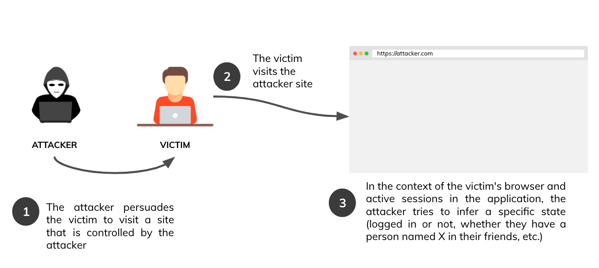
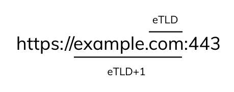
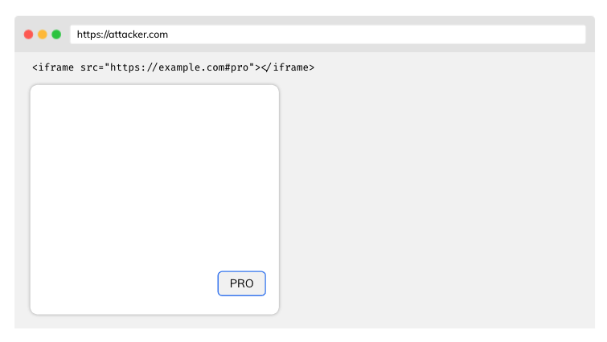
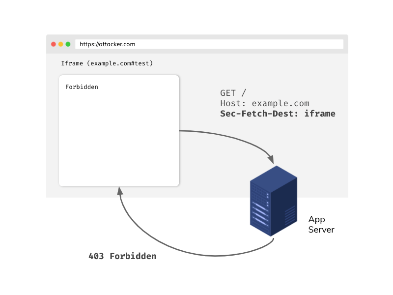
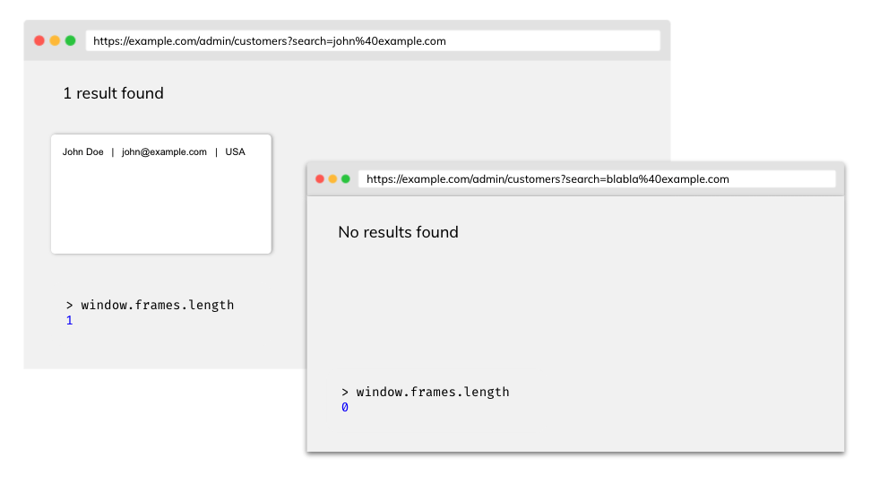
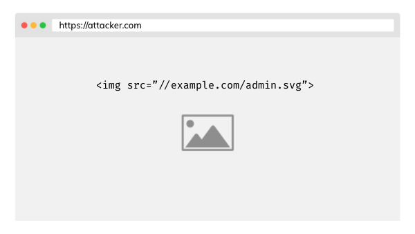

# XS Leaks

## Pengantar untuk XS Leaks

Artikel ini menjelaskan contoh serangan dan pertahanan terhadap kerentanan kebocoran lintas situs (XS Leaks). Karena kerentanan ini didasarkan pada mekanisme inti peramban web modern, kerentanan ini juga disebut serangan saluran samping peramban. Serangan XS-Leaks berupaya mengeksploitasi fakta informasi yang tampaknya tidak penting yang dipertukarkan dalam komunikasi lintas situs antar situs. Informasi ini menyimpulkan jawaban atas pertanyaan yang diajukan sebelumnya tentang akun pengguna korban. Harap lihat contoh yang diberikan di bawah ini:

- Apakah pengguna saat ini masuk?
- Apakah ID pengguna 1337?
- Apakah pengguna adalah administrator?
- Apakah pengguna memiliki orang dengan alamat email tertentu dalam daftar kontak mereka?

Atas dasar pertanyaan tersebut, penyerang mungkin mencoba menyimpulkan jawabannya, tergantung pada konteks aplikasi. Dalam kebanyakan kasus, jawabannya akan berbentuk biner (ya atau tidak). Dampak dari kerentanan ini sangat bergantung pada profil risiko aplikasi. Meskipun demikian, XS Leaks dapat menimbulkan ancaman nyata terhadap privasi dan anonimitas pengguna.

## Vektor serangan



- Seluruh serangan terjadi di sisi peramban korban - sama seperti serangan XSS
- Dalam beberapa kasus, korban harus tetap berada di situs penyerang lebih lama agar serangan berhasil.

## Kebijakan Asal yang Sama (SOP)

Sebelum menjelaskan serangan, ada baiknya untuk memahami salah satu mekanisme keamanan paling penting di peramban - Kebijakan Asal yang Sama. Beberapa aspek utama:

- Dua URL dianggap sebagai **asal yang sama** jika **protokol**, **port**, dan **host** mereka sama
- Setiap asal dapat mengirim permintaan ke sumber lain, tetapi karena Kebijakan Asal yang Sama, mereka tidak akan dapat membaca respons secara langsung
- Kebijakan Asal yang Sama dapat dilonggarkan oleh [Berbagi Sumber Daya Lintas Asal (CORS)](https://developer.mozilla.org/en-US/docs/Web/HTTP/CORS).

| Origin A              | Origin B                  | Same origin?                   |
| -------------         | -------------             | -------------                  |
| `https://example.com` | `http://sub.example.com`  | No, different hosts             |
| `https://example.com` | `https://example.com:443` | Yes! Implicit port in Origin A |

Meskipun prinsip SOP melindungi kita dari mengakses informasi dalam komunikasi lintas asal, serangan XS-Leaks berdasarkan data residual dapat menyimpulkan beberapa informasi.

## Cookie SameSite

Atribut SameSite dari sebuah cookie memberi tahu browser apakah harus menyertakan cookie dalam permintaan dari situs lain. Atribut SameSite mengambil nilai berikut:

- `None` - cookie akan dilampirkan ke permintaan dari situs lain, tetapi harus dikirim melalui saluran HTTPS yang aman
- `Lax` - cookie akan ditambahkan ke permintaan dari halaman lain jika metode permintaan adalah GET dan permintaan dibuat ke navigasi tingkat atas (misalnya navigasi mengubah alamat di bilah atas browser)
- `Strict` - cookie tidak akan pernah dikirim dari situs lain

Perlu disebutkan di sini sikap browser berbasis Chromium di mana cookie tanpa atribut SameSite yang ditetapkan secara default diperlakukan sebagai Lax.

Cookie SameSite merupakan mekanisme **pertahanan-mendalam** yang kuat terhadap **beberapa** kelas XS Leaks dan [serangan CSRF](https://cheatsheetseries.owasp.org/cheatsheets/Cross-Site_Request_Forgery_Prevention_Cheat_Sheet.html), yang dapat secara signifikan mengurangi permukaan serangan, tetapi mungkin tidak sepenuhnya menghentikannya (lihat, misalnya, serangan [XS Leak berbasis jendela](https://soheilkhodayari.github.io/same-site-wiki/docs/attacks/xs-leaks.html) seperti serangan [frame counting](https://xsleaks.dev/docs/attacks/frame-counting/) dan [navigation](https://xsleaks.dev/docs/attacks/navigations/)).

### Bagaimana kita tahu bahwa dua situs adalah SameSite?



Dalam konteks atribut SameSite, kami menganggap situs tersebut merupakan gabungan dari TLD (top-level domain) dan nama domain sebelumnya. Misalnya:

| Full URL                                      | Site (eTLD+1)             |
| --------------------------------------------  | ------------------------  |
| `https://example.com:443/data?query=test`     | `example.com`             |

Mengapa kita berbicara tentang eTLD+1 dan bukan hanya TLD+1? Itu karena domain seperti `.github.io` atau `.eu.org`. Bagian-bagian tersebut tidak cukup atomik untuk dibandingkan dengan baik. Untuk alasan ini, daftar TLD "efektif" (eTLD) dibuat dan dapat ditemukan [di sini](https://publicsuffix.org/list/public_suffix_list.dat).

Situs yang memiliki eTLD+1 yang sama dianggap SameSite, contohnya:

| Origin A                  | Origin B                   | SameSite?                    |
| ------------------------- | -------------------------- | ---------------------        |
| `https://example.com`     | `http://example.com`       | Yes, schemes don't matter    |
| `https://evil.net`        | `https://example.com`      | No, different eTLD+1          |
| `https://sub.example.com` | `https://data.example.com` | Yes, subdomains don't matter |

Untuk informasi lebih lanjut tentang SameSite, lihat artikel yang bagus [Memahami "same-site"](https://web.dev/same-site-same-origin/).

## Serangan menggunakan atribut ID elemen

Elemen dalam DOM dapat memiliki atribut ID yang unik dalam dokumen. Misalnya:

```html
<button id="pro">Pro account</button>
```

Peramban akan secara otomatis fokus pada elemen dengan ID tertentu jika kita menambahkan hash ke URL, misalnya `https://example.com#pro`. Terlebih lagi, [peristiwa fokus](https://developer.mozilla.org/en-US/docs/Web/API/Element/focus_event) JavaScript diaktifkan. Penyerang dapat mencoba menyematkan aplikasi dalam iframe dengan sumber tertentu pada halaman yang dikontrolnya sendiri:



lalu menambahkan listener dalam dokumen utama untuk [peristiwa blur](https://developer.mozilla.org/en-US/docs/Web/API/Element/blur_event) (kebalikan dari fokus). Saat korban mengunjungi situs penyerang, peristiwa blur diaktifkan. Penyerang akan dapat menyimpulkan bahwa korban memiliki akun pro.

### Pertahanan

#### Perlindungan bingkai

Jika Anda tidak memerlukan asal lain untuk menanamkan aplikasi Anda dalam bingkai, Anda dapat mempertimbangkan untuk menggunakan salah satu dari dua mekanisme:

- Arahan **nenek moyang bingkai Kebijakan Keamanan Konten**. [Baca selengkapnya tentang sintaksis](https://developer.mozilla.org/en-US/docs/Web/HTTP/Headers/Content-Security-Policy/frame-src).
- **X-Frame-Options** - terutama jika Anda ingin mendukung peramban lama.

Menyiapkan perlindungan bingkai secara efisien memblokir kemampuan untuk menanamkan aplikasi Anda dalam bingkai pada asal yang dikendalikan penyerang dan melindungi dari serangan lain seperti [Clickjacking](https://cheatsheetseries.owasp.org/cheatsheets/Clickjacking_Defense_Cheat_Sheet.html).

#### Ambil metadata (Sec-Fetch-Dest)

Header Sec-Fetch-Dest memberi kita sepotong informasi tentang apa tujuan akhir dari permintaan tersebut. Header ini disertakan secara otomatis oleh browser dan merupakan salah satu header dalam standar Fetch Metadata.

Dengan Sec-Fetch-Dest Anda dapat membangun kebijakan isolasi sumber daya sendiri yang efektif, misalnya:

```javascript
app.get('/', (req, res) => {
    if (req.get('Sec-Fetch-Dest') === 'iframe') {
        return res.sendStatus(403);
    }
    res.send({
        message: 'Hello!'
    });
});
```



Jika Anda ingin menggunakan header dari standar Fetch Metadata, pastikan browser pengguna Anda mendukung standar ini (Anda dapat memeriksanya [di sini](https://caniuse.com/?search=sec-fetch)). Selain itu, pertimbangkan untuk menggunakan fallback yang sesuai dalam kode jika header Sec-Fetch-* tidak disertakan dalam permintaan.

## Serangan berdasarkan peristiwa kesalahan

Penyematan dari sumber daya dari sumber lain umumnya diizinkan. Misalnya, Anda dapat menyematkan gambar dari sumber lain atau bahkan skrip di halaman Anda. Yang tidak diizinkan adalah membaca sumber daya lintas-asal karena kebijakan SOP.

Saat browser mengirimkan permintaan untuk sumber daya, server memproses permintaan dan memutuskan responsnya, misalnya (200 OK atau 404 TIDAK DITEMUKAN). Peramban menerima respons HTTP dan berdasarkan respons tersebut, peristiwa JavaScript yang sesuai diaktifkan (onload atau onerror).

Dengan cara ini, kita dapat mencoba memuat sumber daya dan, berdasarkan status respons, menyimpulkan apakah sumber daya tersebut ada atau tidak dalam konteks korban yang login. Mari kita lihat situasi berikut:

- `GET /api/user/1234` - 200 OK - pengguna yang saat ini login adalah 1234 karena kami berhasil memuat sumber daya (peristiwa [onload](https://developer.mozilla.org/en-US/docs/Web/API/GlobalEventHandlers/onload) dipicu)
- `GET /api/user/1235` - 401 Tidak Sah - 1235 bukan ID pengguna yang saat ini login (peristiwa [onerror](https://developer.mozilla.org/en-US/docs/Web/API/GlobalEventHandlers/onerror) akan dipicu)

Mengingat contoh di atas, penyerang dapat menggunakan JavaScript pada origin yang dikendalikannya untuk menebak ID korban dengan menghitung semua nilai dalam loop sederhana.

```javascript
function checkId(id) {
    const script = document.createElement('script');
    script.src = `https://example.com/api/users/${id}`;
    script.onload = () => {
        console.log(`Logged user id: ${id}`);
    };
    document.body.appendChild(script);
}

// Generate array [0, 1, ..., 40]
const ids = Array(41)
    .fill()
    .map((_, i) => i + 0);

for (const id of ids) {
    checkId(id);
}
```

Perhatikan bahwa penyerang di sini tidak peduli dengan pembacaan isi respons meskipun hal itu tidak dapat dilakukan karena mekanisme isolasi yang solid di browser seperti [Cross-Origin Resource Blocking](https://www.chromium.org/Home/chromium-security/corb-for-developers). Yang dibutuhkan hanyalah informasi keberhasilan yang diterimanya saat peristiwa `onload` diaktifkan.

### Pertahanan

#### Perlindungan SubResource

Dalam beberapa kasus, mekanisme token unik khusus dapat diterapkan untuk melindungi titik akhir sensitif kita.

```
/api/users/1234?token=be930b8cfb5011eb9a030242ac130003
```

- Token harus panjang dan unik
- Back-end harus memvalidasi token yang diteruskan dalam permintaan dengan benar

Meskipun cukup efektif, solusi tersebut menghasilkan overhead yang signifikan dalam implementasi yang tepat.

#### Ambil metadata (Sec-Fetch-Site)

Header ini menentukan dari mana permintaan dikirim, dan mengambil nilai berikut:

- `cross-site`
- `same-origin`
- `same-site`
- `none` - pengguna langsung membuka halaman

Seperti Sec-Fetch-Dest, header ini secara otomatis ditambahkan oleh browser ke setiap permintaan dan merupakan bagian dari standar Fetch Metadata. Contoh penggunaan:

```javascript
app.get('/api/users/:id', authorization, (req, res) => {
    if (req.get('Sec-Fetch-Site') === 'cross-site') {
        return res.sendStatus(403);
    }

    // ... more code

    return res.send({ id: 1234, name: 'John', role: 'admin' });
});
```

#### Cross-Origin-Resource-Policy (CORP)

Jika server mengembalikan header ini dengan nilai yang sesuai, browser tidak akan memuat sumber daya dari situs atau asal kami (bahkan gambar statis) di aplikasi lain. Nilai yang mungkin:

- `same-site`
- `same-origin`
- `cross-origin`

Baca selengkapnya tentang CORP [di sini](https://resourcepolicy.fyi/).

## Serangan pada komunikasi postMessage

Terkadang dalam situasi terkendali, kita ingin, terlepas dari SOP, untuk bertukar informasi antara asal yang berbeda. Kita dapat menggunakan mekanisme postMessage. Lihat contoh di bawah ini:

```javascript
// Asal: http://example.com
const site = new URLSearchParams(window.location.search).get('site'); // https://evil.com
const popup = window.open(site);
popup.postMessage('pesan rahasia!', '*');

// Asal: https://evil.com
window.addEventListener('message', e => {
alert(e.data) // pesan rahasia! - bocor
});
```

### Pertahanan

#### Tentukan targetOrigin yang ketat

Untuk menghindari situasi seperti di atas, saat penyerang berhasil mendapatkan referensi jendela untuk menerima pesan, selalu tentukan `targetOrigin` yang tepat di postMessage. Melewati karakter pengganti `targetOrigin` `*` menyebabkan asal mana pun menerima pesan.

```javascript
// Origin: http://example.com
const site = new URLSearchParams(window.location.search).get('site'); // https://evil.com
const popup = window.open(site);
popup.postMessage('secret message!', 'https://sub.example.com');

// Origin: https://evil.com
window.addEventListener('message', e => {
    alert(e.data) // no data!
});
```

## Serangan penghitungan bingkai

Informasi tentang jumlah bingkai yang dimuat dalam jendela dapat menjadi sumber kebocoran. Ambil contoh aplikasi yang memuat hasil pencarian ke dalam bingkai, jika hasilnya kosong maka bingkai tidak muncul.



Seorang penyerang dapat memperoleh informasi tentang jumlah bingkai yang dimuat dalam jendela dengan menghitung jumlah bingkai dalam objek `window.frames`.

Jadi akhirnya, seorang penyerang dapat memperoleh daftar email dan, dalam satu putaran sederhana, membuka jendela berikutnya dan menghitung jumlah bingkai. Jika jumlah bingkai di jendela yang dibuka sama dengan 1, email tersebut ada di basis data klien aplikasi yang digunakan oleh korban.

### Pertahanan

#### Kebijakan Pembuka Lintas Asal (COOP)

Menyetel tajuk ini akan mencegah dokumen lintas asal dibuka dalam grup konteks penelusuran yang sama. Solusi ini memastikan bahwa dokumen A yang membuka dokumen lain tidak akan memiliki akses ke objek `window`. Nilai yang mungkin:

- `unsafe-none`
- `same-origin-allow-popups`
- `same-origin`

Jika server mengembalikan misalnya header COOP `same-origin`, serangan gagal:

```javascript
const win = window.open('https://example.com/admin/customers?search=john%40example.com');
console.log(win.frames.length) // Tidak dapat membaca properti 'length' dari null
```

## Serangan menggunakan cache browser

Cache browser membantu mengurangi waktu yang dibutuhkan halaman untuk dimuat saat dikunjungi kembali secara signifikan. Namun, cache tersebut juga dapat menimbulkan risiko kebocoran informasi. Jika penyerang dapat mendeteksi apakah suatu sumber daya dimuat dari cache setelah waktu pemuatan, ia akan dapat menarik beberapa kesimpulan berdasarkan hal tersebut.

Prinsipnya sederhana, sumber daya yang dimuat dari memori cache akan dimuat jauh lebih cepat daripada dari server.



Seorang penyerang dapat menanamkan sumber daya di situs mereka yang hanya dapat diakses oleh pengguna dengan peran admin. Kemudian, menggunakan JavaScript, membaca waktu muat sumber daya tertentu dan, berdasarkan informasi ini, menyimpulkan apakah sumber daya tersebut ada dalam cache atau tidak.

```javascript
    // Threshold above which we consider a resource to have loaded from the server
    // const THRESHOLD = ...

    const adminImagePerfEntry = window.performance
        .getEntries()
        .filter((entry) => entry.name.endsWith('admin.svg'));

    if (adminImagePerfEntry.duration < THRESHOLD) {
        console.log('Image loaded from cache!')
    }
```

### Pertahanan

#### Token yang tidak dapat diprediksi untuk gambar

Teknik ini akurat ketika pengguna ingin sumber daya tetap di-cache, sementara penyerang tidak akan dapat mengetahuinya.

```
/avatars/admin.svg?token=be930b8cfb5011eb9a030242ac130003
```

- Token harus unik dalam konteks setiap pengguna
- Jika penyerang tidak dapat menebak token ini, penyerang tidak akan dapat mendeteksi apakah sumber daya dimuat dari cache

#### Menggunakan header Cache-Control

Anda dapat menonaktifkan mekanisme cache jika Anda menerima penurunan kinerja yang terkait dengan kebutuhan memuat ulang sumber daya dari server setiap kali pengguna mengunjungi situs. Untuk menonaktifkan caching untuk sumber daya yang ingin Anda lindungi, tetapkan header respons `Cache-Control: no-store`.

## Rekomendasi cepat

- Jika aplikasi Anda menggunakan cookie, pastikan untuk menyetel [atribut SameSite](#samesite-cookies) yang sesuai.

- Pikirkan apakah Anda benar-benar ingin mengizinkan aplikasi Anda disematkan dalam bingkai. Jika tidak, pertimbangkan untuk menggunakan mekanisme yang dijelaskan di bagian [perlindungan bingkai](#framing-protection).

- Untuk memperkuat isolasi aplikasi Anda di antara sumber lain, gunakan header [Kebijakan Sumber Daya Lintas Asal](#cross-origin-resource-policy-corp) dan [Kebijakan Pembuka Lintas Asal](#cross-origin-opener-policy-coop) dengan nilai yang sesuai.

- Gunakan header yang tersedia dalam Fetch Metadata untuk membangun kebijakan isolasi sumber daya Anda sendiri.

## Referensi

### XS Leaks

- [XS Leaks Wiki](https://xsleaks.dev/)
- [XS Leaks Attacks & Prevention](https://www.appsecmonkey.com/blog/xs-leaks)

### Fetch Metadata

- [Fetch Metadata and Isolation Policies](https://www.appsecmonkey.com/blog/fetch-metadata)
- [Lindungi sumber daya Anda dari serangan dengan Fetch Metadata](https://web.dev/fetch-metadata/)

### Perlindungan framing

- [Mencegah framing dengan kebijakan](https://pragmaticwebsecurity.com/articles/securitypolicies/preventing-framing-with-policies.html)
- [Kebijakan 'frame-ancestors' CSP](https://content-security-policy.com/frame-ancestors/)

### SameSite

- [Penjelasan cookie SameSite](https://web.dev/samesite-cookies-explained/)
- [Resep cookie SameSite](https://web.dev/samesite-cookie-recipes/)

### Header COOP dan CORP

- [Menjadikan situs Anda "terisolasi lintas asal"](https://web.dev/coop-coep/)
- [Dokumen Web MDN tentang CORP](https://developer.mozilla.org/en-US/docs/Web/HTTP/Cross-Origin_Resource_Policy_%28CORP%29)

###### Copyright © - This cheat sheet was created from the OWASP CheatSheetSeries reference - Source :` https://cheatsheetseries.owasp.org/ `